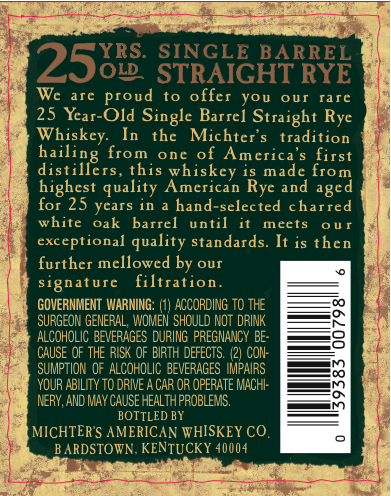
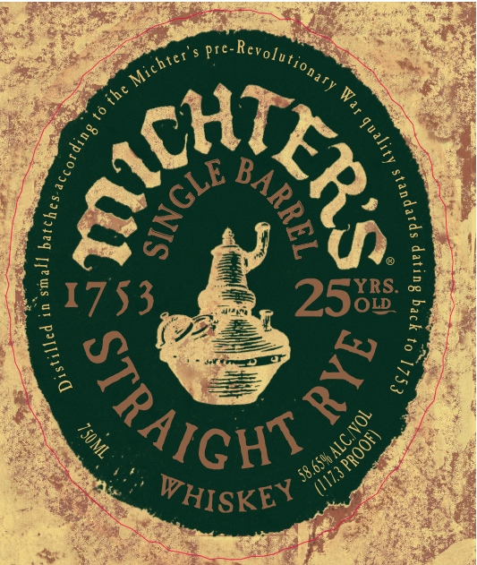
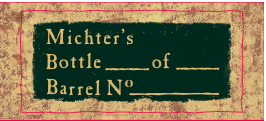

# TTB COLA Label Images - TTBID 08182001000002

**Brand Name:** MICHTER'S

**Fanciful Name:** 25YR SINGLE BARREL

**Issue Date:** 07/08/2008

**Origin Code:** 22

**Product Class/Type:** 102

**Source:** [TTB Public COLA Registry](https://ttbonline.gov/colasonline/viewColaDetails.do?action=publicFormDisplay&ttbid=08182001000002)

## Label Images

### Back Label

### Label 1

### Label 2

## Extracted Label Text

*Text extracted via OCR - may contain errors*

*2 image(s) excluded: text did not meet readability threshold*

### Back Label

SINGLE BARREL
25818 STRGICHTRYE
Wc
tc
proud
to
offer
you
OUI
TJic
25 Ycar-Old Singlc Barrel Straight Ryc
Whiskcy:
thc
Michter $
tradition
from
one of
Amcrica $
first
distillers
this whiskcy is
from
highcst quality Amcrican Rye and
for 25 ycars in
hand-selected charred
white
oak
barrel
until
meets
0 U I
exceptional quality standards: It is thcn
furthcr mcllowed by our
sgnaturc
filtration
GOVERNMENT WARNING;
ACCORDING TO THE
SURGEON GENERAL, WOMEN  ShCuLD NOT DRINK
ALCOHOLIC BEVERAGES DuRING PREGMANCY BE-
CAUSE OF THE RISK oF EIRTH DEFECTS (21 CON:
SuMPTION of ALCoHOLIC BEVERAGES IMPAIRS
YOUR ABILITY TO DRIVE
CAR OR OPERATE MACHI:
NERY, AND MAY CAuSE HEALTH PROBLEMS.
BOTTLED BY
MICHTERS AMERICAN WHISKEY CO.
ARDSTOVN. KENTUCKY 40004
bailing
made
aged
