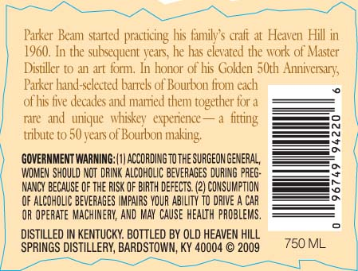
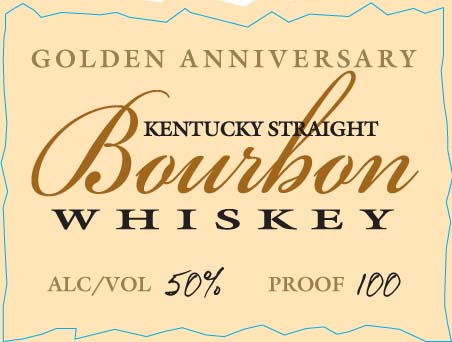

# TTB COLA Label Images - TTBID 09112001000216

**Brand Name:** PARKER'S HERITAGE COLLECTION

**Fanciful Name:** GOLDEN ANNIVERSARY

**Issue Date:** 04/23/2009

**Origin Code:** 22

**Product Class/Type:** 101

**Source:** [TTB Public COLA Registry](https://ttbonline.gov/colasonline/viewColaDetails.do?action=publicFormDisplay&ttbid=09112001000216)

## Label Images

### Back Label

### Front Label

## Extracted Label Text

*Text extracted via OCR - may contain errors*

### Back Label

a

Parker Beam started practicing his family’s craft at Heaven Hill in
1960. In the subsequent years, he has elevated the work of Master
Distiller to an art form. In honor of his Golden 50th Anniversary,
Parker hand-selected barrels of Bourbon from each
of his five decades and married them together for a
rare and unique whiskey experience— a fiting
tribute to 50 years of Bourbon making,

‘GOVERNMENT WARNING: (1) ACCORDING TOTHE SURGEON GENERAL,
‘WOMEN SHOULD NOT DRINK ALCOHOLIC BEVERAGES DURING PREG-
NANCY BECAUSE OF THE RISK OF BIRTH DEFECTS. (2) CONSUMPTION.
OF ALCOHOLIC BEVERAGES IMPAIRS YOUR ABILITY TO DRIVE A CAR
OR OPERATE MACHINERY, AND MAY CAUSE HEALTH PROBLEMS.

DISTILLED IN KENTUCKY. BOTTLED BY OLD HEAVEN HILL
SPRINGS DISTILLERY, BARDSTOWN, KY 40004. © 2009 750 ML

### Front Label

GOLDEN ANNIVERSARY

lao

WHISKEY

ALC/VOL 50%

PROOF /00
