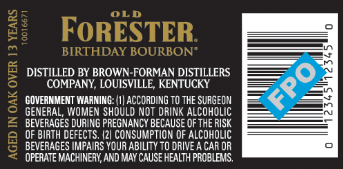
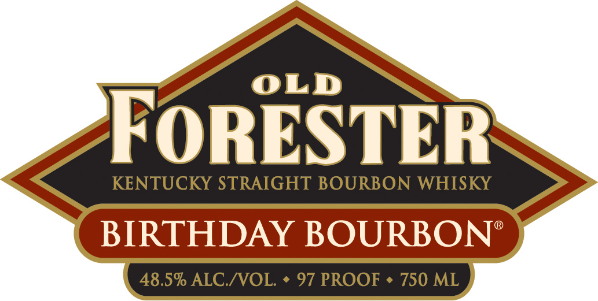
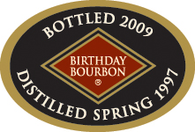
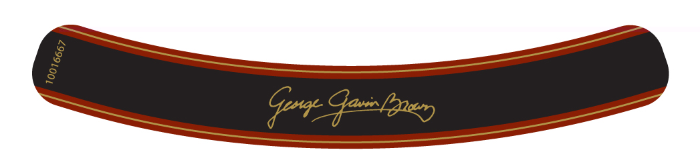
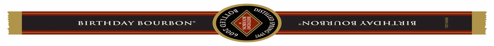

# TTB COLA Label Images - TTBID 09124001000215

**Brand Name:** OLD FORESTER

**Fanciful Name:** BIRTHDAY BOURBON

**Issue Date:** 05/06/2009

**Origin Code:** 22

**Product Class/Type:** 101

**Source:** [TTB Public COLA Registry](https://ttbonline.gov/colasonline/viewColaDetails.do?action=publicFormDisplay&ttbid=09124001000215)

## Label Images

### Back Label

### Front Label

### Label 3

### Label 4

### Label 5

## Extracted Label Text

*Text extracted via OCR - may contain errors*

*2 image(s) excluded: text did not meet readability threshold*

### Back Label

OLD
28
FoRESTER
BIRTHDAY BOURBON"
8
DISTILLED BY BROWN-FORMAN DISTILLERS
COMPANY, LOUISVILLE; KENTUCKY
GOVERNMENT WARNING: (1| ACCORDING TO THE SURGEON
3
GENERAL, WOMEN SHOULD NOT DRINK AlcOHOLIC
BEVERAGES DURING PREGNANCY BECAUSE OF THE RISK
OF BIRTH DEFECTS. (2) CONSUMPTION OF ALCOHOLIC
9
BEVERAGES IMPAIRS YOUR ABILITY TO DRIVE A CAR OR
OPERATE MACHINERY; AND MAY CAUSE HEALTH PROBLEMS.
FPO

### Front Label

OLD

FORESTER

KENTUCKY STRAIGHT BOURBON WHIS

USO AIDS Dome Ne

### Label 3

BIRTHDAY
BOURBON
4
BOTTLED
2009
OISTILLED
SPRING
