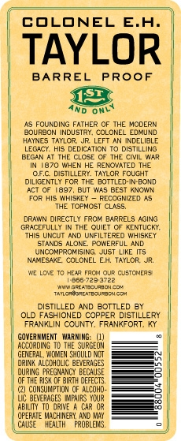
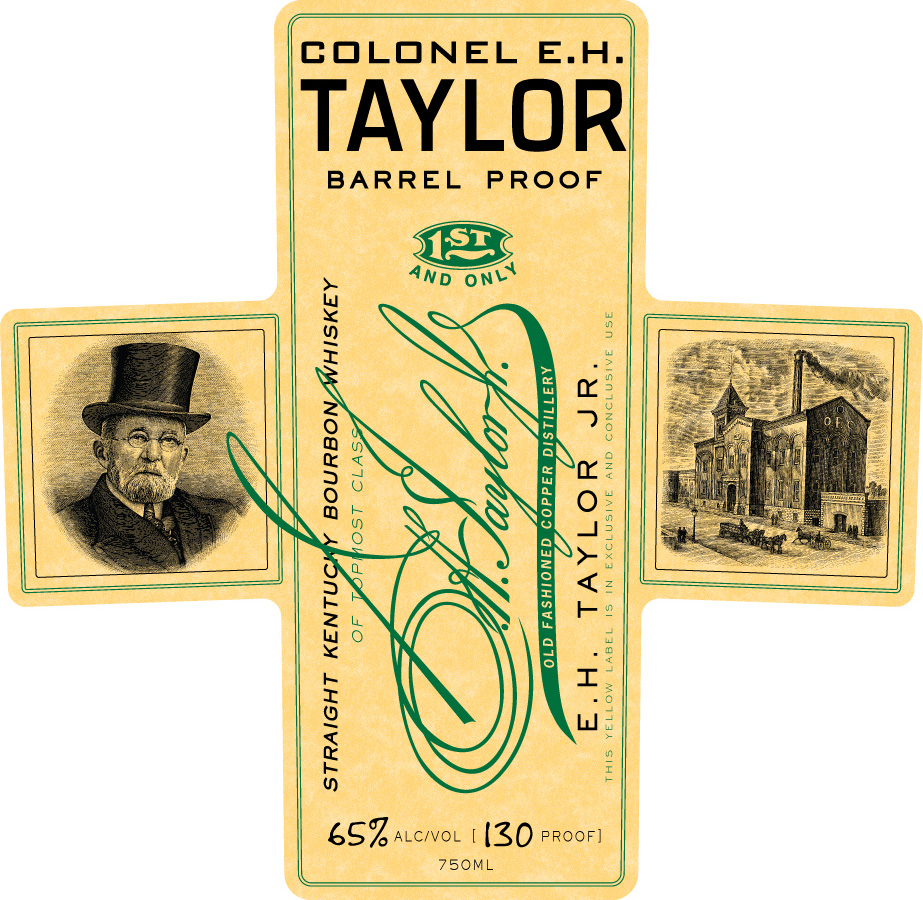
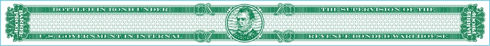

# TTB COLA Label Images - TTBID 10117001000094

**Brand Name:** E. H. TAYLOR JR.

**Fanciful Name:** BARREL PROOF

**Issue Date:** 05/19/2010

**Origin Code:** 22

**Product Class/Type:** 101

**Source:** [TTB Public COLA Registry](https://ttbonline.gov/colasonline/viewColaDetails.do?action=publicFormDisplay&ttbid=10117001000094)

## Label Images

### Back Label

### Label 1

### Label 3

## Extracted Label Text

*Text extracted via OCR - may contain errors*

*1 image(s) excluded: text did not meet readability threshold*

### Back Label

COLONEL E.H.

TAYLOR

BARREL PROOF

Ano one

As FOUNDING FATHER OF THE MODERN
Souraon buster eoLONEL EOMUND
samme Tavton. Jt LEFT AN INDELIBLE
Zour. Ms DEDIeATN To cIsTLLNG
BEGAN AT THE CLOSE OF THE GIL WAR
TN'1970 WHEN HE RENOVATED THE
‘Of6 DSTLLERY TaYOR FOUGHT
‘centr FOR THE BOTTLEDN COND
MET GF 1807, BLT Was BEST INO
FoR Wis WHISEY ~ RECOGNIZED A
“HE TOmNST Case
DRAWN DIRECTLY FROM BABRELS AGING
GRACEFULLY IN THE QUIET OF KENTUCKY
“HS UNGUT AND UNFILTERED WHISKEY
STANES ALONE. POWERFUL AND
UNCOMPROMISING JUST LE ITs
AWHESME COLONEL EH TALON
noneeereou ca
DISTILLED AND BOTTLED BY
O10 FASHIONED COPPER DISTILLERY
TRANLIN COUNTY, FRANKFORT. KY
GaveENTaRNN 0) °
AORDWE To THE URGED
Te on ct ——
Tre Le ARS st
ane Pec BECAUSE
ce
teas ne ot —s
0 —
ABLIN 10 OVE A CAR 0, os
Core McK io et ———<—
USE HEALTH PROBL

### Label 1

TAYLOR

COLONEL E.H.

BARREL PROOF

750ML

ES7. accivot | (30 rroorl
