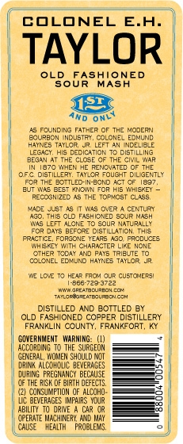
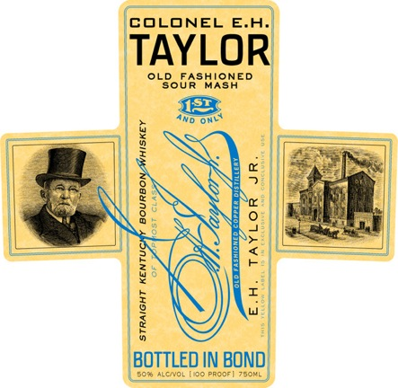

# TTB COLA Label Images - TTBID 10117001000096

**Brand Name:** E. H. TAYLOR JR.

**Fanciful Name:** SOUR MASH

**Issue Date:** 05/19/2010

**Origin Code:** 22

**Product Class/Type:** 101

**Source:** [TTB Public COLA Registry](https://ttbonline.gov/colasonline/viewColaDetails.do?action=publicFormDisplay&ttbid=10117001000096)

## Label Images

### Back Label

### Label 1

### Label 3

## Extracted Label Text

*Text extracted via OCR - may contain errors*

*1 image(s) excluded: text did not meet readability threshold*

### Back Label

COLONEL E.A
TAYLOR
OLD
BoURSHISNED
MASH
AMd
ONL
FCUNDIRG FATHER OF THE MOJERN
FCU-RDN
NCJSTR
COLON:E
GoMinc
HATNES TAYLCR
MEFT 4
DaIBLE
LEGACY, His CEDICATION TO DISTILLING
HoGot
IF CL0s;
Civil "4P
4370"HEl HF Roncter
Distillzzy, TaY_CR {oveht DI SENTLI
7oR TF
33TTLID-IN-ECNC
Fu AWaS
3a67 Tu FOp
FIs HISKE
Pecoshizec
Toz"as
CL4ss
Udlc-
CEMlR
Th3 CLD FASHICNEC SOJR Mash
ALCI
COF
NATL?ULI
derer
SLLADN
FpaLDL
32046
(TAps
FACCUCaS
WHISKEY YF
ChaprcteR Likc NONS
CTHER
TCCAT
ANj Fats TRIEUTE
ec-NC
HAYNE
WYLCF
He4? MrCM QUR CUSTOMER3I
366-7703722
DiaCREATADUAPOY ED
Taopigsca ejupamhcih
DISTILLED AND BOTTLED @
OLD FASHIONED COPPER DISTILLERY
FRANKLIN CCUNTY, FRANKFORT, Ky
GONERNMEMT   WARNING:  (U)
ACCIROIG
THE SURGEOM
CeneraL, WOMEM ShOUlD MDI
Drink AlcIhIuc BEVEPASES
CURIN FREGMANCY BECAUSE
C THE HISK
riptk
defeCTS
CONSUMFTION
Alcoho
C BEVERAGES IMFMIRS YCUR
ABILITY
pie
C4R CR
OPERATE MacHIERY ANd May
CavSE
HEALTH
FRQBLERS

### Label 1

COLONEL E.Aj
TAYLOR
OLD
LBobRSHYONED

%
1
1
1

1
BOTTLED IN BOND
ALcCCL | OC PRCDF
JsoKL
