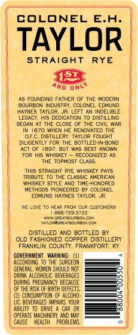
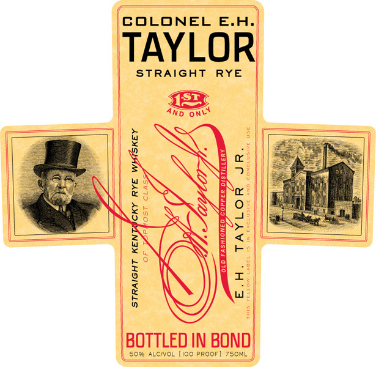

# TTB COLA Label Images - TTBID 10117001000098

**Brand Name:** E. H. TAYLOR JR.

**Fanciful Name:** STRAIGHT RYE

**Issue Date:** 05/19/2010

**Origin Code:** 22

**Product Class/Type:** 102

**Source:** [TTB Public COLA Registry](https://ttbonline.gov/colasonline/viewColaDetails.do?action=publicFormDisplay&ttbid=10117001000098)

## Label Images

### Back Label

### Label 1

### Label 3

## Extracted Label Text

*Text extracted via OCR - may contain errors*

*2 image(s) excluded: text did not meet readability threshold*

### Back Label

COLONEL E.A_
TAYLOR
STRAIGHT
RYE
552
~CJNDING
FATHER C THE MCOERN
BOURBCN INDUSTRY, CCLONEL ECXUND
HATNES TAYLC?
JR; LEFT AN
INDELIALE
LEGACY HIS DEDICATION
DISTILLING
Eelna
CLOSE
C7 THE Cil
"HEN HE RENOVATED TRE
DISTILLERY. TAYLCR FCUGHT
DILIGENTLY FC? THE BCTTLED-IN-BOND
397, But WAS
BEST KNOTN
His WHEsKCY
RECCGNZEL
THE TopMosT CLASS
THIS StraIGHT RYE WHISKE
PAYS
Tribute To THE CLASSIC AMERICAN
WihiskEY STYLE AND TIME-HONORED
METHCDs
pioveerEc
BX COLONEL
Eu
HATNES
TAYLOR
HE L0 ?
He4? FRO4 CUR
CUSIOHER:
3e67203797
36e4120U7204{04
TAILCRCURZ- ECLRECNESH
DISTILLED AND BOTTLED @Y
OLD FASHIONED CCPPER CISTILLERY
FRANKLIN CCUNTY, FRANKFORT, Ky
GONERNMEMT   WARMING:
AcCIRdIN; To THE SURGEOM
GENERAL, WOMEM ShQULD NDT
cbinR AlcohCl bevepases
CURING FREGMANCY BECAUSE
C THE HISK
BI3TH DEFECTS
CONSUMFTION OF AlCOHO
VC BEVERAGES IMfxRS YCUR
ABILITY
DRIWE
GPERATE MacHERY AND May
CAWSE
HEALTH
PRQBLERS
3
