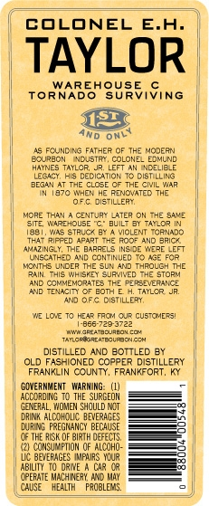
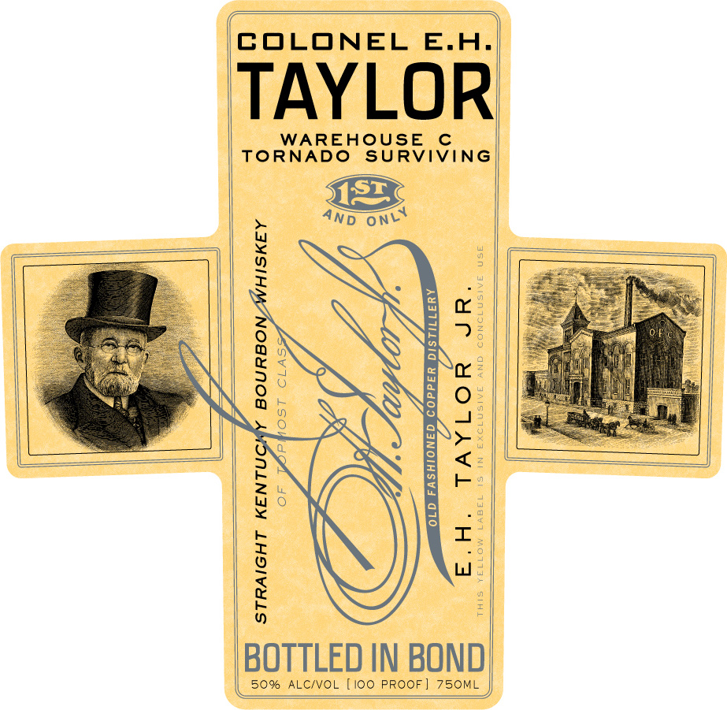

# TTB COLA Label Images - TTBID 10117001000106

**Brand Name:** E. H. TAYLOR JR.

**Fanciful Name:** WAREHOUSE C

**Issue Date:** 05/19/2010

**Origin Code:** 22

**Product Class/Type:** 101

**Source:** [TTB Public COLA Registry](https://ttbonline.gov/colasonline/viewColaDetails.do?action=publicFormDisplay&ttbid=10117001000106)

## Label Images

### Back Label

### Label 1

### Label 3

## Extracted Label Text

*Text extracted via OCR - may contain errors*

*1 image(s) excluded: text did not meet readability threshold*

### Back Label

COLONEL E.H.

TAYLOR:

WAREHOUSE ©

TORNADO SURVIVING

an

<

AS FOUNDING FATHER OF THE NoDERN

SUzON DUSTRY COLONEL

Ea

HAYNES TAYLOR. LEFT AN DELILE

EG At THE close OF THE GW aR

{Eesey, He DEDIEATION 70 DISTALNG

IN 1870 WHEN HE RENOVATED THE

OFe lerlieey

MORE THAN A CENTURY LATER ON THE SAME:

Ei

WARENOUSE "C” BL

‘ar sawon I

Tei, Was STRUCK BY A VOLENT TORNADO

hay speed APT THE ROE AND Shoe

IMUNQNGLY, THE BARRELS SOE WESE LEFT

'ONSEATHED AND CONTINUED TO AGE FOR

OWTFE UNDER TE SUN AND THROU THE

|

PAN

SND coMNewonsTes The PERSEVERANCE

iS WSKEY SURIVED THE STOR

|

ane Sener oF som EH TALON

|

ino OF OSTLLERY

LOWE 70 Hea Pn CR CUSTOMERS!

"eevesaree

sun renasinonee

roigasteorec oo

DISTILLED AND BOTTLED BY

OLD FASHIONED COPPER DISTILLERY

FRANKLIN COUNTY, FRANKFORT, KY

VERNENT_ WARNING. (1),

AQOOROMG TO THE SURGEON

GENERAL, OMEN SHOULD NOT

=a

‘hiv aloowoue aeveaces

ua PREGHANCT BECAUSE

OFTHE IS OF al EFECS.

=|

| cqacenon oe Alon

LUC BEVERAGES INPURS TOUR

—

|

ALD VE ce  —ses

(OPERATE MACHER AND A

CAUSE REAL" PROBLENS

=

))

### Label 1

"a
COLONEL E.H.

TAYLOR

WAREHOUSE
TORNADO SURVIVING

BOURBON/WHISKEY

BOTTLED IN BOND

(50% ALC/VOL [100 PROOF] 750ML
