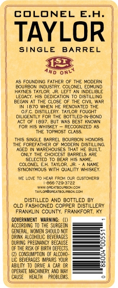
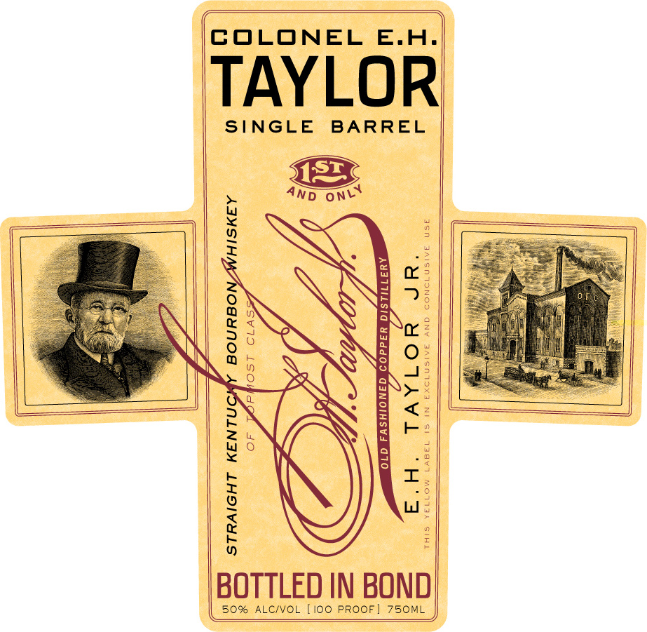
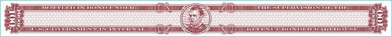

# TTB COLA Label Images - TTBID 10117001000129

**Brand Name:** E. H. TAYLOR JR.

**Fanciful Name:** SINGLE BARREL

**Issue Date:** 05/19/2010

**Origin Code:** 22

**Product Class/Type:** 101

**Source:** [TTB Public COLA Registry](https://ttbonline.gov/colasonline/viewColaDetails.do?action=publicFormDisplay&ttbid=10117001000129)

## Label Images

### Back Label

### Label 1

### Label 3

## Extracted Label Text

*Text extracted via OCR - may contain errors*

### Back Label

COLONEL E.H.

TAYLOR

SINGLE BARREL

AnD ow

1S FOUNDING FATHER OF THE MODERN

BQURBON INDUSTRY. COLONEL EOHIND

HAINES TATLOR. JR LEFT AN INDELIBLE

TEGacy, Hs DEDICATION TO DISTILLING

BEGIN AT THE CLOSE OF THE CIVIL WAR,

TW 1870 WHEN HE RENOVATED THE

DIMGENTEY FORTHE BOTTLED IN-BOND

‘OF DISTILLERY. TAYLOR FOUGHT

‘ACT OF 1897, BUT WAS BEST KNOWN

FOR HIS. WHISKEY ~ RECOGNIZED AS

"THE TOPMOST CLASS.

THE FOREFATHER OF MODERN DISTLLING

THIS SINGLE BARREL BOURBON HONORS

"AGED IN WAREHOUSES THAT HE BUILT,

‘ONLY THE CHOICEST BARRELS ARE

‘SELECTED TO SEAR His NAME.

COLONEL EM, TAYLOR, IR" A NAME

SINONYMOUS WITH QUALITY WHISKEY,

NE LOVE To HEAR FROM CUR CUSTOMERS

Se reeaee

wa earourcon

bores cn

DISTILLED AND BOTTLED BY

‘OLD FASHIONED COPPER DISTILLERY

FRANKLIN COUNTY, FRANKFORT, KY

GOVERNMENT. WARNING: (),

AOCORDNG TO THE SURGEGN

GENERA NOME SHOULD NOT

==.

DRI ALCOHOLIC BEVERAGES

as

==

DURING PREC BECAUSE

DF THE 1 Ge TH DEFECTS

(2) CONSUMPTON oF ALCO.

—F

Uc BEVERAGES Hares YOUR

ABILIY TO ORVE A CAR OR

je

CFERATE MWCHDERE AND AY

CAUSE HEATH ROBLES,

S)

### Label 1

COLONEL E.H.

TAYLOR

SINGLE BARREL

4ND oN

SX

em Oo

2

aN

26

ex

'

“at

© Ng

Ny Ot

mm —!

aN

N>

WW Oo

X/

~

BOTTLED IN BOND

50% ALC/VOL [100 PROOF] 750ML
