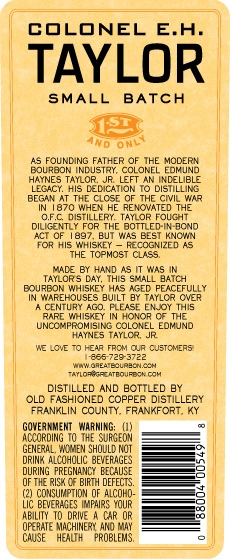
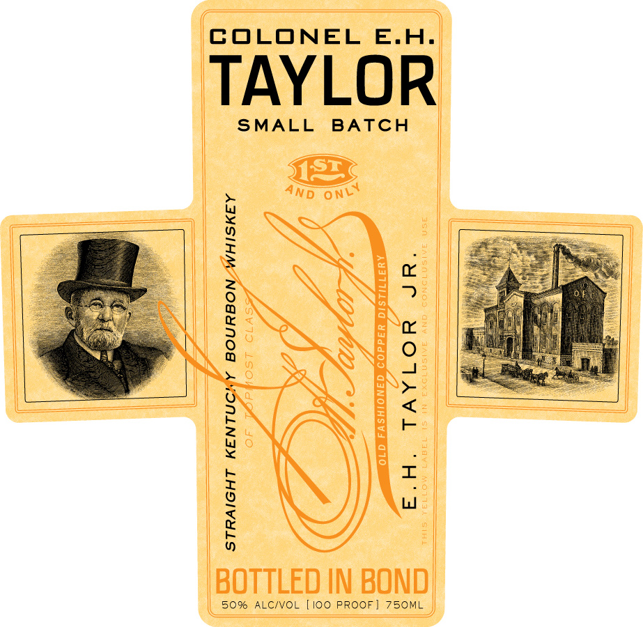

# TTB COLA Label Images - TTBID 10117001000132

**Brand Name:** E. H. TAYLOR JR.

**Fanciful Name:** SMALL BATCH

**Issue Date:** 05/19/2010

**Origin Code:** 22

**Product Class/Type:** 101

**Source:** [TTB Public COLA Registry](https://ttbonline.gov/colasonline/viewColaDetails.do?action=publicFormDisplay&ttbid=10117001000132)

## Label Images

### Back Label

### Label 1

### Label 3

## Extracted Label Text

*Text extracted via OCR - may contain errors*

### Back Label

—

——

—_—__

——

COLONEL E.H.

TAYLOR

SMALL BATCH

AnD OMe

‘AS FOUNDING FATHER OF THE MODERN

[BOURBON INDUSTRY. COLONEL EOMAND

HAINES TAYLOR JR LEFT AN INDELILE

ECAC, Als DEDICATION TO DISILLING

BEGAN AT THE CLOSE OF THE CIVIL WAR,

TN 1870 WHEN HE RENOVATED THE

‘Of. DSTLLERY. TarwoR FOUGHT

DIUGENTEY FORTHE BOTTLED:IN-GOND

"ACE OF 187, BUT WAS BEST KNOWN

FOR His WHISKEY ~ RECOGNIZED AS

THE TOPMOST CLASS.

MADE BY HAND AST WAS

TAMLORS DAY. THIS SHALL BATCH

BOURBON WHISKEY HAS AGED PEACEFULLY

TN WAREROUSES BUILT BY TAYLOH OVER

‘A CENTURY AGO. PLEASE ENOY THIS

FARE WHISKEY IN.HONOR OF THE.

LUNSOHPRONISING COLONEL EDMUND

HAINES TATLOR. JR

NE LOVE TO HEAR TRON aR CUSTNERS

ree yeo sree

Par

en

on

tonnes ot

DISTILLED AND BOTTLED ay

OLD FASHIONED COPPER DISTILLERY

FRANKLIN COUNTY. FRANKFORT. KY

|

OvERHOENT. WARNING (1),

|

AOCOROING TO THE SURGEDN

GENERAL, OMEN SHOULD NOT

—

|

DRINK ALCOHCLC BEVERAGES

ae |

DURING. REGION BECAUSE

OFTHE eT DEFECTS

—s

(2) CONSUMPTION oF ALCON

—_,

Uc BEVERAGES uPAR YOUR

SS

"ABU T0 ORE. A CAR OR

| PERNT MACHER A MY

a

CAUSE HEATH” ROBLES

——

### Label 1

‘COLONEL E.H.

TAYLOR

|

SMALL BATCH

ll

baer

ane

f

)

||

SX

||

||

|

|

|

||

||

|

|

||

||

||

SNE

|

|

i]

[A

BOTTLED IN BOND

| 50% ALC/VOL [100 PROOF] 750ML

### Label 3

elitay

Pye

ga

TIN
