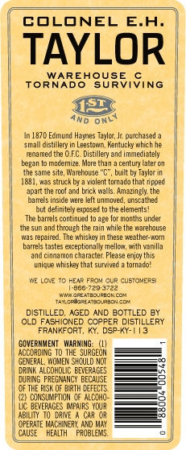
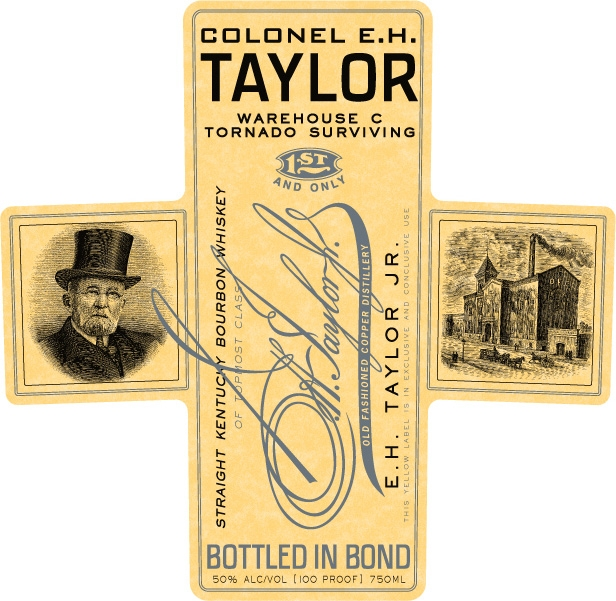

# TTB COLA Label Images - TTBID 10211001000285

**Brand Name:** E.H. TAYLOR JR.

**Fanciful Name:** WAREHOUSE C

**Issue Date:** 08/04/2010

**Origin Code:** 22

**Product Class/Type:** 101

**Source:** [TTB Public COLA Registry](https://ttbonline.gov/colasonline/viewColaDetails.do?action=publicFormDisplay&ttbid=10211001000285)

## Label Images

### Back Label

### Label 1

### Label 2

## Extracted Label Text

*Text extracted via OCR - may contain errors*

*2 image(s) excluded: text did not meet readability threshold*

### Back Label

(

COLONEL E.H.

TAYLOR

WAREHOUSE ©

TORNADO SURVIVING

an

<

In 1870 Edmund Hayes Tc Je puchaed

sal distillery in esto, Kentucky which he

renamed the OFC island immediatly

began modernize. Mae than acestry tron

the same ste, Warehouse", bl by Tayler

181, was stuck bya violent tomada that ppeé

‘apa th ol and beck vals, sang the

hassle mr tune, unseated

but define exposed tothe elements!

The bares continued to ae fox months under

‘he sun ané though the an white warebouse

arpa The whiskey in hase weather nan

bares tastes exceptional melon, wih varia

‘nd canon ehaarte Pease ej tis

unique whisky hat sures afmado!

WE LOW To HEAR Fou cuR cusToNERS

teeerezoree

sinsrenacicnco

neapesarneoncoe

DISTILLED, AGED AND BOTTLED BY

(OLD FASHIONED COPPER DISTILLERY

FRANKFORT, KY, DSE-4V-1 13

OVERNMENT WARING 1)

AODROING To THE SURGEDN

GENERAL, MEN SHOULD NOT

‘Dri aLCOvOUC BEVERAGES

[a

DURING PREGNANCY BECAUSE

OFTHE SK OF aT OEFECTS,

(2) OONSDUPTON  aLcEHO:

Uc BEVERAGES PRS YOUR

ABILITY. TO. DAVE CAR OR

CPERUTE MACHINERY, AND AY

CAUSE "HEALTH PROBLEMS =)
