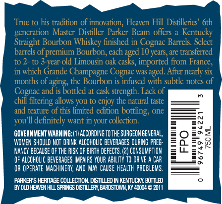
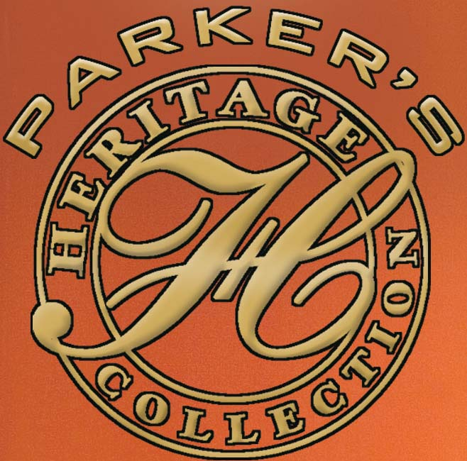
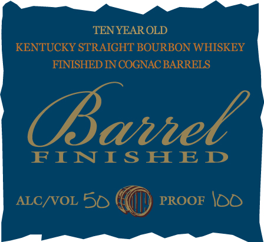

# TTB COLA Label Images - TTBID 11132001000068

**Brand Name:** PARKER'S HERITAGE COLLECTION

**Fanciful Name:** BARREL FINISHED

**Issue Date:** 07/25/2011

**Origin Code:** 22

**Product Class/Type:** 641

**Source:** [TTB Public COLA Registry](https://ttbonline.gov/colasonline/viewColaDetails.do?action=publicFormDisplay&ttbid=11132001000068)

## Label Images

### Back Label

### Front Label

### Label 2

## Extracted Label Text

*Text extracted via OCR - may contain errors*

*1 image(s) excluded: text did not meet readability threshold*

**Detected Age:** 10 Years

### Back Label

True to his tradition of innovation, Heaven Hill Distilleries’ 6th
generation Master Distiller Parker Beam offers a Kentucky
Straight Bourbon Whiskey finished in Cognac Barrels. Select
barrels of premium Bourbon, each aged 10 years, are transferred
10 2- to 3-year-old Limousin oak casks, imported from France,
in which Grande Champagne Cognac was aged. After nearly six
months of aging, the Bourbon is infused with subtle notes of
Cognac and is bottled at cask strength. Lack of 7%
chil filtering allows you to enjoy the natural ste —

and texture of this limited edition botting, on: ——=
you'll definitely want in your collectior ==
GOVERNMENT WARNING: (1) ACCORDING TOTHESURGEONGENERAL, Fie} zo =
WOMEN SHOULD NOT DANK ALCOHOLIC BEVERAGES DURING PRES- =ialetoge
NANCY BECAUSE OF THE RISK OF BIRTH DEFECTS. (2) CONSUMPTION F>MRE=Rd

OF ALCOHOLIC BEVERAGES IMPAIRS YOUR ABILITY TO DRIVE A CAR =P

OR OPERATE MACHINERY, AND MAY CAUSE HEALTH PROBLEMS. SSS
PARKER'S HERITAGE COLLECTION. DISTILLED IN KENTUCKY, BOTTLED °
‘BYOLD HEAVEN HL SPRINGS STE BARDSTOWN, KY 40004 © 2011

i

### Label 2

TEN YEAR OLD

KENTUCKY STRAIGHT BOURBON WHISKEY

FINISHED IN COGNAC BARRELS

Baril

FINISHED

ALC/VOL 5O PROOF \OO
