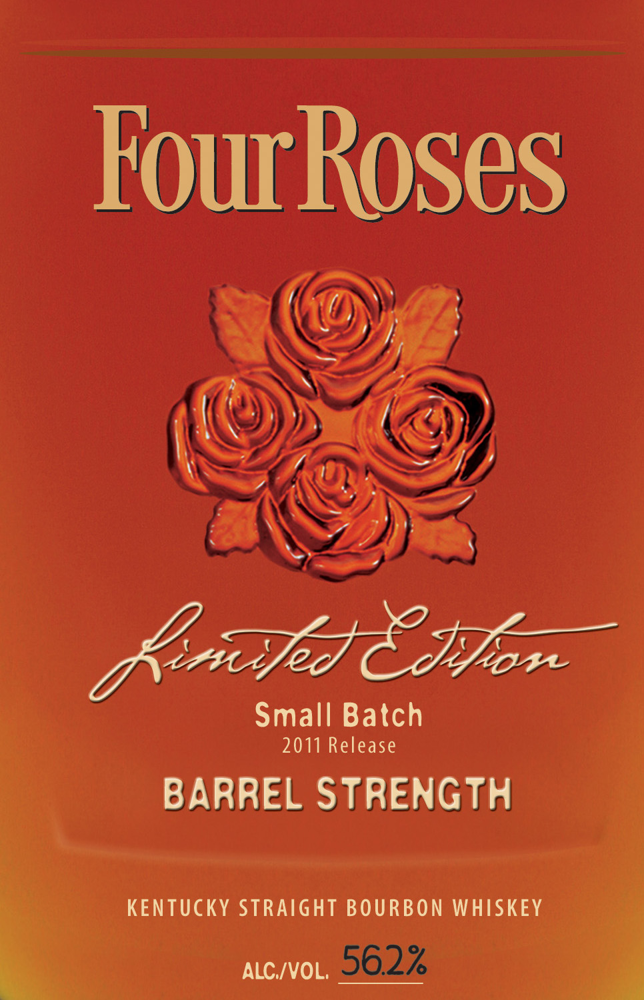
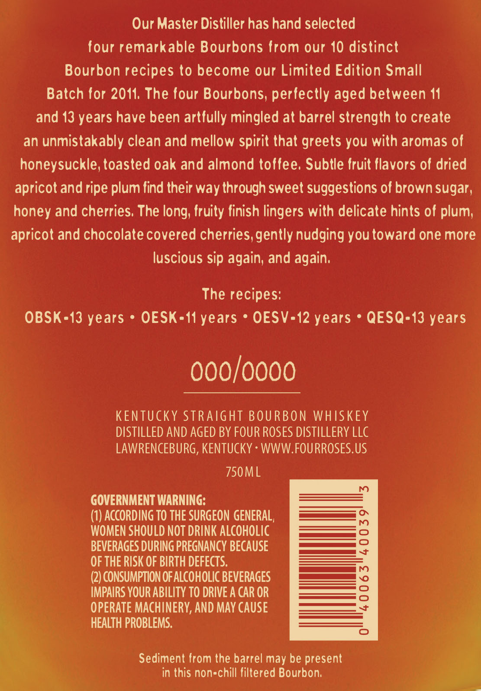
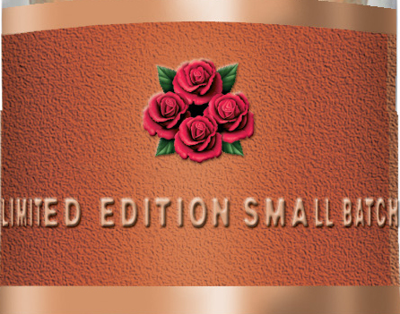

# TTB COLA Label Images - TTBID 11136001000208

**Brand Name:** FOUR ROSES

**Fanciful Name:** LIMITED EDITION SMALL BATCH

**Issue Date:** 06/27/2011

**Origin Code:** 22

**Product Class/Type:** 101

**Source:** [TTB Public COLA Registry](https://ttbonline.gov/colasonline/viewColaDetails.do?action=publicFormDisplay&ttbid=11136001000208)

## Label Images

### Label 1

### Label 2

### Label 3

## Extracted Label Text

*Text extracted via OCR - may contain errors*

### Label 1

Fourhoses

BARREL STRENGTH

ie, KENTUCKY STRAIGHT BOURBON WHISKEY
q nico, i

### Label 2

Our Master Distiller has hand selected

four remarkable Bourbons from our 10 distinct

Bourbon recipes to become our Limited Edition Small

Batch for 2011. The four Bourbons, perfectly aged between 11

and 13 years have been artfully mingled at barrel strength to create

an unmistakably clean and mellow spirit that greets you with aromas of

honeysuckle, toasted oak and almond toffee. Subtle fruit flavors of dried

apricot and ripe plum find their way through sweet suggestions of brown sugar,

honey and cherries. The long, fruity finish lingers with delicate hints of plum,

apricot and chocolate covered cherries, gently nudging you toward one more

luscious sip again, and again.

The recipes:

OBSK=13 years * OESK=11 years * OESV=12 years * QESQ=13 years

000/0000

KENTUCKY STRAIGHT BOURBON WHISKEY

DISTILLED AND AGED BY FOUR ROSES DISTILLERY LLC

LAWRENCEBURG, KENTUCKY - WWW.FOURROSES.US

750ML

GOVERNMENT WARNING:

(1) ACCORDING TO THE SURGEON GENERAL,

————5

WOMEN SHOULD NOT DRINK ALCOHOLIC

— fod

BEVERAGES DURING PREGNANCY BECAUSE

a

es

OF THE RISK OF BIRTH DEFECTS.

ae)

(2) CONSUMPTION OF ALCOHOLIC BEVERAGES

ee

IMPAIRS YOUR ABILITY TO DRIVE A CAR OR

OPERATE MACHINERY, AND MAY CAUSE

HEALTH PROBLEMS.

Sediment from the barrel may be present

in this nonechill filtered Bourbon,

### Label 3

Oy
Roe
SS
WED ED Rise MALL EAT
