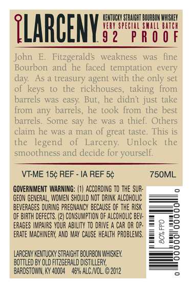
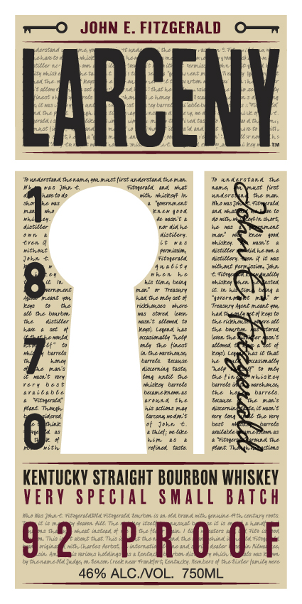

# TTB COLA Label Images - TTBID 12096001000336

**Brand Name:** LARCENY

**Fanciful Name:** VERY SPECIAL SMALL BATCH

**Issue Date:** 05/04/2012

**Origin Code:** 22

**Product Class/Type:** 101

**Source:** [TTB Public COLA Registry](https://ttbonline.gov/colasonline/viewColaDetails.do?action=publicFormDisplay&ttbid=12096001000336)

## Label Images

### Back Label

### Label 1

### Label 3

## Extracted Label Text

*Text extracted via OCR - may contain errors*

*1 image(s) excluded: text did not meet readability threshold*

### Back Label

ENTUCKY STRAIGHT BOURBON WHISKEY

VERY SPECIAL SMALL B

92 PROOF

TLARCENY

John E.

Fitzgerald's weakness was fine

eons and he faced temptation every

day

As a treasury agent with the only set

of

s to the rickhous

taking from

barrels was easy. But, he did

int just take

from any barrels, he too

from the best

barrels. Some say he was a thief. Others

aim he was a man of

great taste. This is

the legend of

Li

ny

Unlock the

smoothness and decide for yourself.

VIEME 15¢ REF - IA REF 5¢

750ML

GOVERNMENT WARNING: (1) ACCORDING TO THE SUR

GEON GENERAL, WOMEN SHOULD NOT DRINK ALCOHOLIC

‘BEVERAGES DURING PREGNANCY BECAUSE OF THE RISK

‘OF BIRTH DEFECTS. (2) CONSUMPTION OF ALCOHOLIC BEY-

ERAGES IMPAIRS YOUR ABILITY TO DRIVE A CAR OR OP-

ERATE MACHINERY, AND MAY CAUSE HEALTH PROBLEMS.

‘STRAIGHT BOURBON WHISKEY.

‘BOTTLED BY OLD FITZGERALD DISTILLERY,

BARDSTOWN, KY 40004 46% ALC VOL. © 2012

### Label 1

JOHN E. FITZGERALD

o—

Candy

a

|

2

bee

a

|

or

att

undertand hens ym mast fit anderen the mat

und

tank the

toe

th say

haors

the mat

ome

nen foek

font

a

chart

fant

erat he

rae

ase

Sie

went

an

move

hem k

donee

fiems

oy

when be

guecie

ne

nant

a ina, oie,

ein

Ma te lyst

"prernrmhe

OF

we rom

oe

tm sot ee

as

fest

ave eae at

ph eter has

tan amet

loan tal

jae

tnd the inact

temas,

tase

nant

tele tans

rau

ng ate tha

sieey tarred

tating

whiskey

braleabee

vary beat

Beaman ss

barrece

re

Pane Tansee

‘satis may

srtund the

eae

mans

aren net’

of poke e

fey og

the wey

lee

hem ae a

Dich.

vein taste

KENTUCKY STRAIGHT BOURBON WHISKEY

VERY SPECIAL SMALL BATCH

a Me

la rs nH

eee

"ha

mee

0

46% ALC./VOL. 750ML
