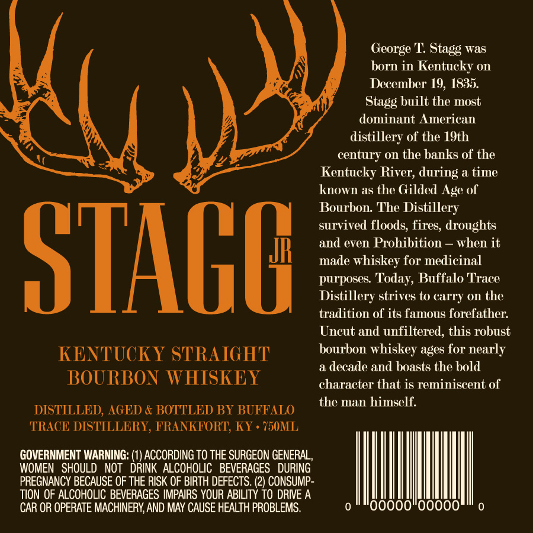
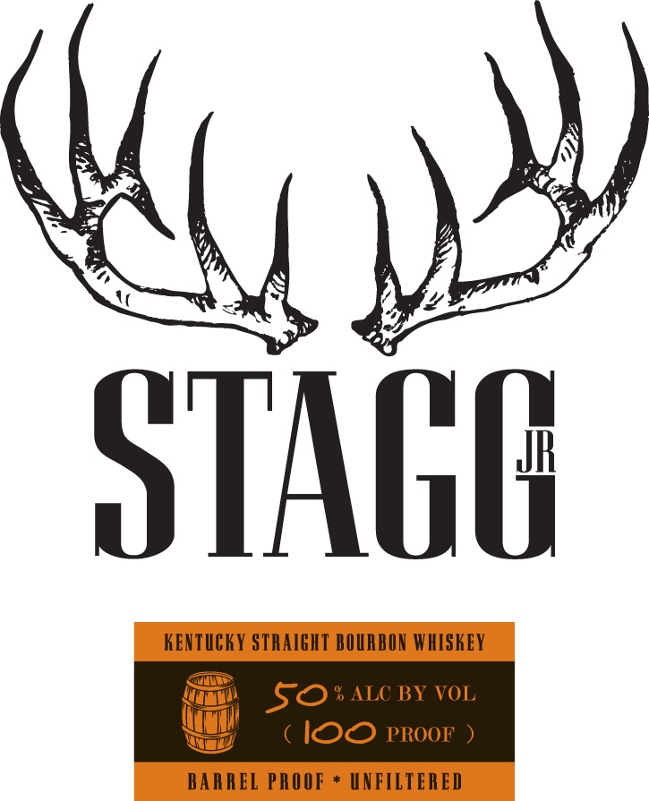

# TTB COLA Label Images - TTBID 12355001000167

**Brand Name:** STAGG JR

**Fanciful Name:**  

**Issue Date:** 01/18/2013

**Origin Code:** 22

**Product Class/Type:** 101

**Source:** [TTB Public COLA Registry](https://ttbonline.gov/colasonline/viewColaDetails.do?action=publicFormDisplay&ttbid=12355001000167)

## Label Images

### Back Label

### Label 1

## Extracted Label Text

*Text extracted via OCR - may contain errors*

### Back Label

George T
was
born in Kentucky on
December 19, 1835.
Stagg built the most
dominant American
distillery of the 19th
century on the banks of the
Kentucky River; during
a time
known as the Gilded Age of
Bourbon The
Distillery
survived floods, fires, droughts
and even Prohibition
when it
STAGU
made whiskey for medicinal
purposes Today; Buffalo TTrace
Distillery strives to carry on the
tradition of its famous forefather:
Uncut and unfiltered, this robust
KENTUCKY STRAIGHT
bourbon whiskey ages for nearly
a decade and boasts the bold
BOURBON WHISKEY
character that is reminiscent of
the man himself.
DISTILLED, AGED & BOTTLED BY BUFFALO
TRACE DISTILLERY, FRANKFORT;, KY
750ML
GOVERNMENT WARNING: (1) ACCORDING TO THE SURGEON GENERAL
WOMEN   SHOULD   NOT
DRINK  ALCOHOLIC   BEVERAGES
DURING
PREGNANCY BECAUSE OF THE RISK OF BIRTH DEFECTS
2) CONSUMP-
TION OF ALCOHOLIC BEVERAGES IMPAIRS YOUR ABILITY TO DRIVE A
CAR OR OPERATE MACHINERY AND MAY CAUSE HEALTH PROBLEMS.
Stagg
(1

### Label 1

STAGH
KeNTuCKY STRAIGHT BOURBON WHISKEY
5o
% ALC BY VOL
IOO PROOF
BARREL PROOF
UNFILIERED
Ncl )
