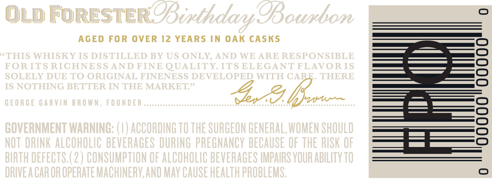
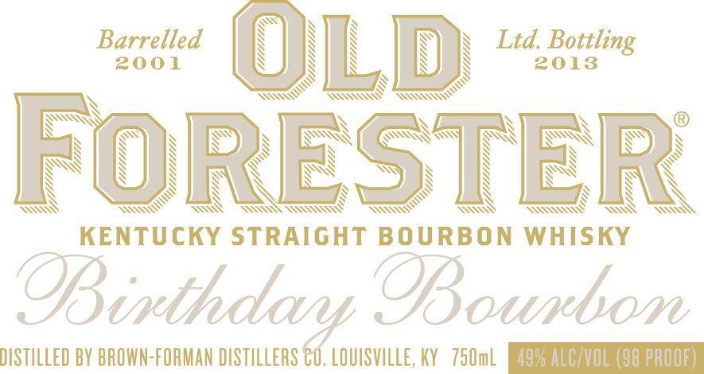
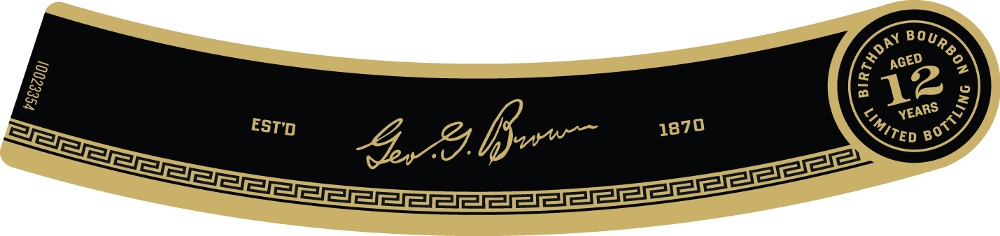
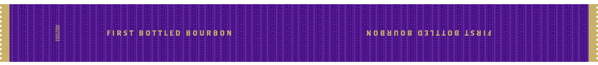
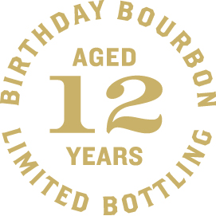

# TTB COLA Label Images - TTBID 13049001000282

**Brand Name:** OLD FORESTER

**Fanciful Name:** BIRTHDAY BOURBON 2013

**Issue Date:** 03/26/2013

**Origin Code:** 22

**Product Class/Type:** 101

**Source:** [TTB Public COLA Registry](https://ttbonline.gov/colasonline/viewColaDetails.do?action=publicFormDisplay&ttbid=13049001000282)

## Label Images

### Back Label

### Front Label

### Label 3

### Label 4

### Label 5

## Extracted Label Text

*Text extracted via OCR - may contain errors*

*2 image(s) excluded: text did not meet readability threshold*

### Back Label

AGED FOR OVER 12 YEARS IN OAK CASKS

### Front Label

Ss) N N
OQ) NA ;
Barrelled NaI NTN \ Ltd. Bottling
Ni Ni Ni
2001 NS) NUN \ 2013
N NOT TAA TAA
SX N x
wn N SNK (Ov
N N
SS N
YS N N
N N N
\ wS S S
\ S \ S Ss NY
As Wo TSE TNR SAAN WOH Way

KENTUCKY STRAIGHT BOURBON WHISKY

Bourton

DISTILLED BY BROWN-FORMAN DISTILLERS C0. LOUISVILLE, KY 750mL [EQAOAIMCEO Ian

### Label 4

FIRST BOTTLED BOURBON

NOSUNOd GATLLOG LSal4
