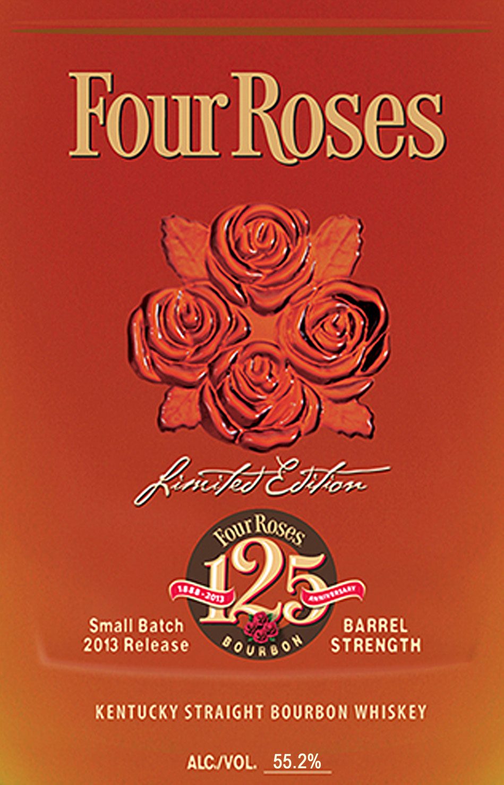
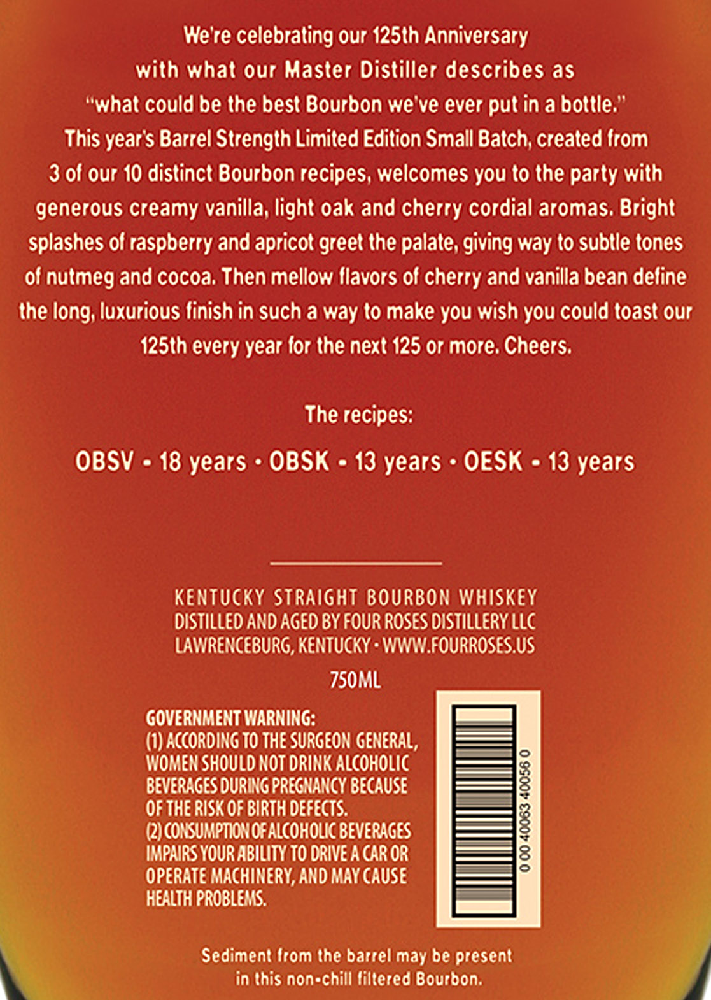

# TTB COLA Label Images - TTBID 13074001000276

**Brand Name:** FOUR ROSES

**Fanciful Name:** LIMITED EDITION SMALL BATCH

**Issue Date:** 04/24/2013

**Origin Code:** 22

**Product Class/Type:** 101

**Source:** [TTB Public COLA Registry](https://ttbonline.gov/colasonline/viewColaDetails.do?action=publicFormDisplay&ttbid=13074001000276)

## Label Images

### Label 1

### Label 2

### Label 3

## Extracted Label Text

*Text extracted via OCR - may contain errors*

*1 image(s) excluded: text did not meet readability threshold*

**Detected Proof:** 110.4
**Detected Age:** 18 Years

### Label 1

FouRoses
KhFx czloz
Small Batch
BARREL
2013 Release
'our6o"
Strength
Kentucky Straight BOURbon Whiskey
ALC IVOL:
55.2%
Roses
Fourz
QD3oD

### Label 3

Were celebrating our 125th Anniversary
with what our Master Distiller describes as
"what could be the best Bourbon we ve ever
in a bottle:'
This year $ Barrel Strength Limited Edition Small Batch; created Irom
3 of our 10 distinct Bourbon recipes, welcomes you to the party with
generous creamy vanilla; light oak and cherry cordial aromas, Bright
splashes of raspberry and apricot greet the palate; giving way to sublle tones
of nutmeg and cocoa, Then mellow Ilavors of cherry and vanilla bean deline
the long; luxurious linish in such a way to make you wish you could toast our
125th every year for the next 125 or more, Cheers;
The recipes:
OBSV
18 years
OBSK
13 years
OESK
13 years
Kentucky Straight BOURbon Whiskey
distilled ANd Aged BY FOUR ROSES OISTILLERY LLC
LAWRENCEBURG, KENTUCKY - WWW FOURROSES.US
750ML
GOVERNMENT WARNING:
(I) according T0 The SURGEON GENERAL,
WOMEN ShoUld NOT DRINK ALCOHOLIC
BEVERAGES OURING PREGNANCY BECAUSE
OF THE RISK OF BIRTH DEFEcts:
1
Q2JCOKSUMPTIONOFALCOHOLIC BEVERAGES
IMPAIRS YOUR ABILITY TO DRIVE A CAR OR
OPERATE MAchIMeRy, AND MAY CAUSE
HEALTH PROBLEMS:.
Sediment Irom the barrel may be present
in (his non-chill liltered Bourbon;
'put
