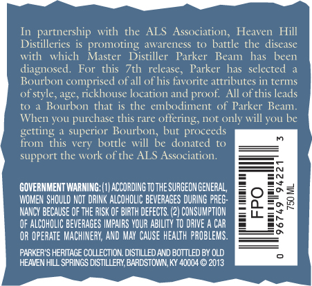
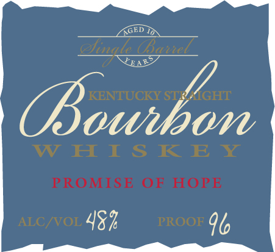

# TTB COLA Label Images - TTBID 13128001000059

**Brand Name:** PARKER'S HERITAGE COLLECTION

**Fanciful Name:** PROMISE OF HOPE

**Issue Date:** 06/09/2013

**Origin Code:** 22

**Product Class/Type:** 101

**Source:** [TTB Public COLA Registry](https://ttbonline.gov/colasonline/viewColaDetails.do?action=publicFormDisplay&ttbid=13128001000059)

## Label Images

### Back Label

### Label 1

## Extracted Label Text

*Text extracted via OCR - may contain errors*

*1 image(s) excluded: text did not meet readability threshold*

### Back Label

In partnership with the ALS Association, Heaven Hill
Distilleries is promoting awareness to battle the disease
with which Master Distiller Parker Beam has been
diagnosed. For this 7th , Parker has selected a
Bourbon comprised ofall of his favorite attributes in terms
of style, age, rickhouse location and proof. All of this leads
to a Bourbon that is the embodiment of Parker Beam.
When you purchase this rare offering, not only will you be
getting a superior Bourbon, but proceeds

from this very bottle will be donated to
support the work of the ALS Association

GOVERNMENT WARNING: (1) ACCORDING TO THE SURGEON GENERAL,
WOMEN SHOULD NOT DRINK ALCOHOLIC BEVERAGES DURING PREG-
NANCY BECAUSE OF THE RISK OF BIRTH DEFECTS. (2) CONSUMPTION
OF ALCOHOLIC BEVERAGES IMPAIRS YOUR ABILITY TD DRIVE A CAR
OR OPERATE MACHINERY, AND MAY CAUSE HEALTH PROBLEMS.

PARKER'S HERITAGE COLLECTION. DISTILLED AND BOTTLED BY OLD
HEAVEN HILL SPRINGS DISTILLERY, BARDSTOWN, KY 40004 © 2013

_— Se CS LS eee
