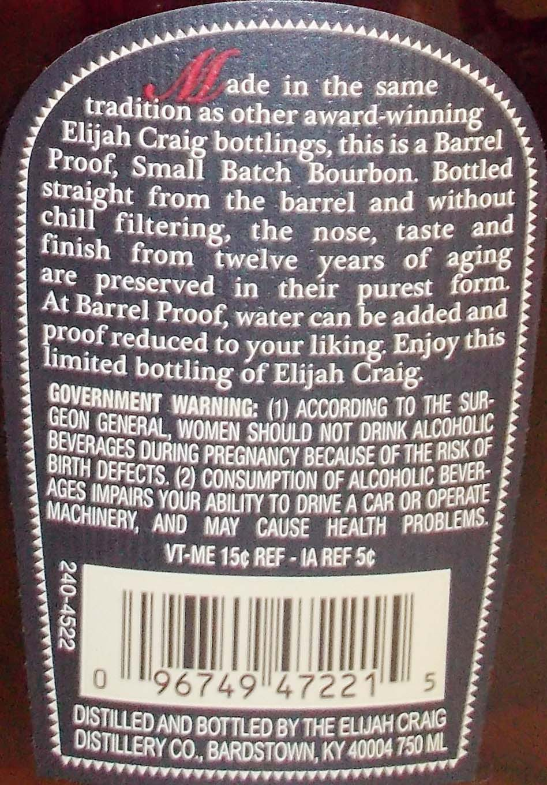
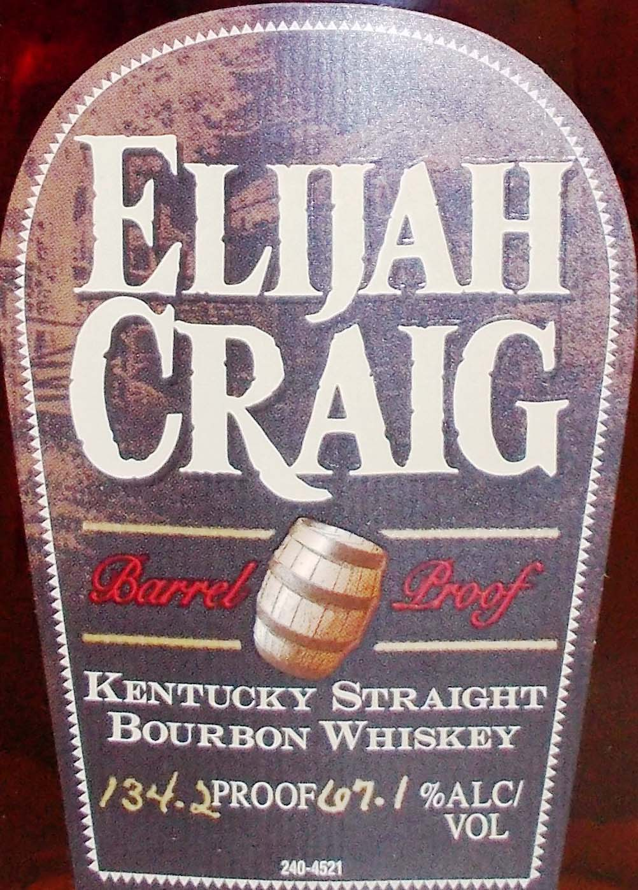

# TTB COLA Label Images - TTBID 13232001000241

**Brand Name:** ELIJAH CRAIG

**Fanciful Name:**  

**Issue Date:** 09/25/2013

**Origin Code:** 22

**Product Class/Type:** 101

**Source:** [TTB Public COLA Registry](https://ttbonline.gov/colasonline/viewColaDetails.do?action=publicFormDisplay&ttbid=13232001000241)

## Label Images

### Back Label

### Front Label

## Extracted Label Text

*Text extracted via OCR - may contain errors*

### Back Label

ade in the same
Itradition as other award-winning
'Saii
this is a Barrel
Proof;
Batch
Bourbon  Bottled
straight
the
barrel and without
chill
the
nose,
taste and
from
twelve
of  aging
are   preserved
in
their   purest
form
At Barrel Proof; water can be added and
Proofreduced to your liking Enjoy
of Elijah Craig
WARNING;
ACCORDING TO THE
GENERAL , WOMEN SHoULD NOT DRINK
OURING PREGNANCY BECAUSE OF THE RISK QF
DEFECTS (2) CONSUMPTION OF ALCOHOLIC
VOUR ABILITY TO ORIVE A CAR OR
AND
MAY
CAUSE   HEALTH
MT-ME 150 REF - IA REF 56
1
0
196749147221
5
AND BOT TLED BY THE ELIJAHO
BARDSTOWN, KY 40004 750 ML
Elijah
bottlings;
from
filtering,
finish
years
this
limited
bottling
GOVERNMENT
SUR-
CEON
ALCOHOLIC
BEVERACES
BIRTH
BEVER-
AGES
IMPAIRS
OPERATE
MACHINERY,
PROBLEMS.
DiStILled
ICRAIG
DISTILLERYCO

### Front Label

ELJAH
CRAIG
Balel
Eogf
KENTUCKY STRAIGHT
BoURBON WHISKEY
134.JPROOFLo7. | %ALCI
VOL
210-1521
