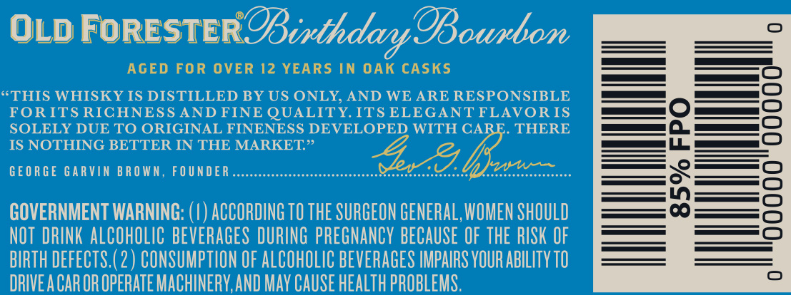
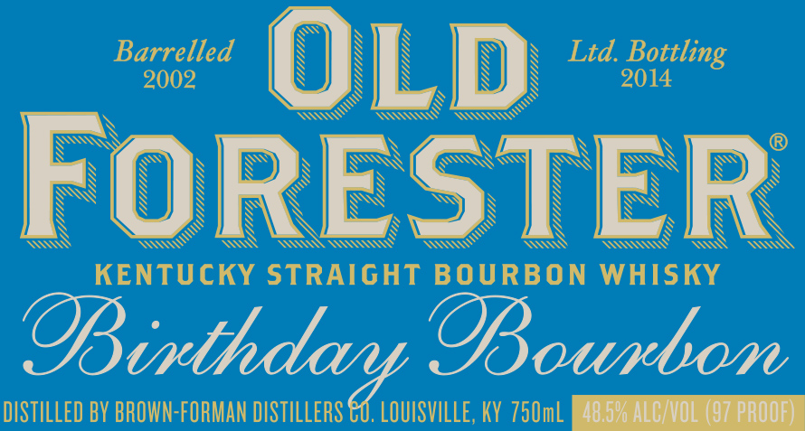

# TTB COLA Label Images - TTBID 14057001000312

**Brand Name:** OLD FORESTER

**Fanciful Name:** BIRTHDAY BOURBON

**Issue Date:** 03/30/2014

**Origin Code:** 22

**Product Class/Type:** 101

**Source:** [TTB Public COLA Registry](https://ttbonline.gov/colasonline/viewColaDetails.do?action=publicFormDisplay&ttbid=14057001000312)

## Label Images

### Back Label

### Label 1

### Label 3

### Label 4

### Label 5

## Extracted Label Text

*Text extracted via OCR - may contain errors*

*1 image(s) excluded: text did not meet readability threshold*

**Detected Proof:** 97
**Detected Age:** 12 Years

### Back Label

OLD FORESTER OBinthdar @Bounbon
AGED FOR OVER 12 YEARS IN OAK CASKS
THIS WHISKY IS DISTILLED BY US ONLY, AND WE ARE RESPONSIBLE
FOR ITS RICHNESS AND FINE QUALITY ITS ELEGANT FLAVOR IS
SOLELY DUE TO ORIGINAL FINENESS DEVELOPED WITH CARE. THERE
IS NOTHING BETTER IN THE MARKET
GEORGE GARVIN BRO WN, FOUNDER
lvw~
1
GOVERNMENT WARNING:
ACCORDING TO THE SURGEON GENERAL, WOMEN SHOULD
NOT DRINK ALCOHOLIC BEVERAGES DURING PREGNANCY BECAUSE OF THE RISK OF
BIRTH DEFECTS, (2 ) CONSUMPTION OF ALCOHOLIC BEVERAGES IMPAIRS VOUR AbILITY TO
DRIVEA CAROR OPERATE MACHINERY,AND May CAUSE HEALTh PROBLEMS.

### Label 1

Baoozled
OLD
Ltd Bott
Bottling
FORESTER
KENTUCKY STRAIGHT BOURBON
WHISKY
@ithdary OBoubom
DISTILLED BY BROWN-FORMAN DISTILLERS €u. LOUISVILLE, KY 75OmL
4052 AlCNOL (97 proof)

### Label 3

ESEECHOH

FIRST BOTTLED BOURBON

NOSUN OA | AIELLO a | FSey

### Label 4

AGED
12
r
YEARS
DAY
)
{
ROTTLING
IMITED
