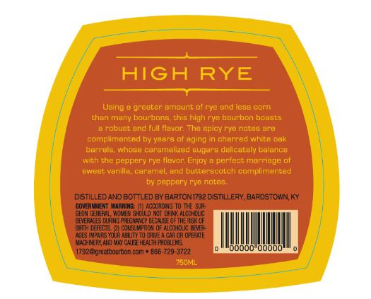
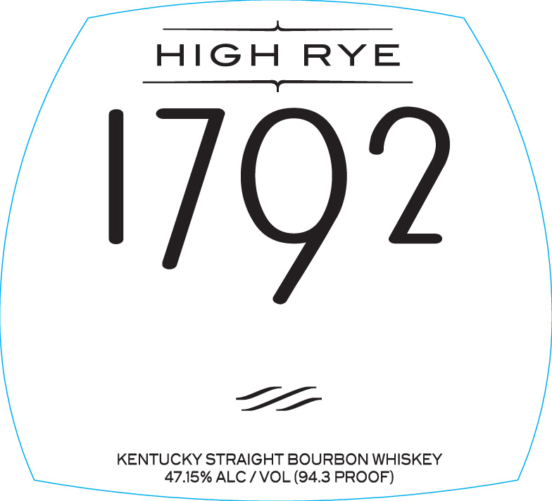

# TTB COLA Label Images - TTBID 14064001000039

**Brand Name:** 1792

**Fanciful Name:**  

**Issue Date:** 03/30/2014

**Origin Code:** 22

**Product Class/Type:** 101

**Source:** [TTB Public COLA Registry](https://ttbonline.gov/colasonline/viewColaDetails.do?action=publicFormDisplay&ttbid=14064001000039)

## Label Images

### Back Label

### Label 1

## Extracted Label Text

*Text extracted via OCR - may contain errors*

*1 image(s) excluded: text did not meet readability threshold*

**Detected Proof:** 94.3

### Label 1

HIGH RYE

oe

KENTUCKY STRAIGHT BOURBON WHISKEY
47.15% ALC / VOL (94.3 PROOF)
