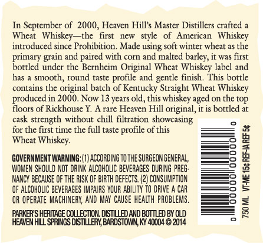
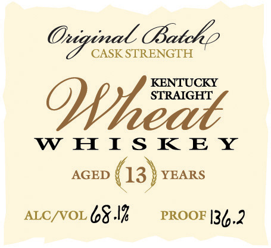

# TTB COLA Label Images - TTBID 14094001000344

**Brand Name:** PARKER'S HERITAGE COLLECTION

**Fanciful Name:** ORIGINAL BATCH

**Issue Date:** 06/03/2014

**Origin Code:** 22

**Product Class/Type:** 149

**Source:** [TTB Public COLA Registry](https://ttbonline.gov/colasonline/viewColaDetails.do?action=publicFormDisplay&ttbid=14094001000344)

## Label Images

### Back Label

### Front Label

## Extracted Label Text

*Text extracted via OCR - may contain errors*

**Detected Age:** 13 Years

### Back Label

In September of 2000, Heaven Hill’s Master Distillers crafted a
Wheat Whiskey—the first new style of American Whiskey
introduced since Prohibition. Made using soft winter wheat as the
primary grain and paired with corn and malted barley, t was first
bottled under the Bernheim Original Wheat Whiskey label and
has a smooth, round taste profile and gentle finish. This bottle
contains the original batch of Kentucky Straight Wheat Whiskey
produced in 2000. Now 13 years old, this whiskey aged on the top
floors of Rickhouse Y. A rare Heaven Hill original, itis bottled at
cask strength without chill filtration showcasing
for the first time the full taste profile of this
Wheat Whiskey.

GOVERNMENT WARNING: (1) ACCORDING TO THE SURGEON GENERAL,
‘WOMEN SHOULD NOT DRINK ALCOHOLIC BEVERAGES DURING PREG-
NANCY BECAUSE OF THE RISK OF BIRTH DEFECTS. (2) CONSUMPTION
OF ALCOHOLIC BEVERAGES IMPAIRS YOUR ABILITY TO DRIVE A CAR
OR OPERATE MACHINERY, AND MAY CAUSE HEALTH PROBLEMS,

‘PARKER'S HERITAGE COLLECTION. DISTILLED AND BOTTLED BY OLD
HEAVEN HILL SPRINGS DISTILLERY, BARDSTOWN, KY 40004 © 2014

REF 5¢

750 ML VI-ME 15¢ REFAA\

### Front Label

Oniginal Batohp
CASK STRENGTH
DWhéut
STRAIGHT
WwWwHIsKkKE Y
AGED ( 13) YEARS
ALC/VOL 6.1% — PROOF [34,2
