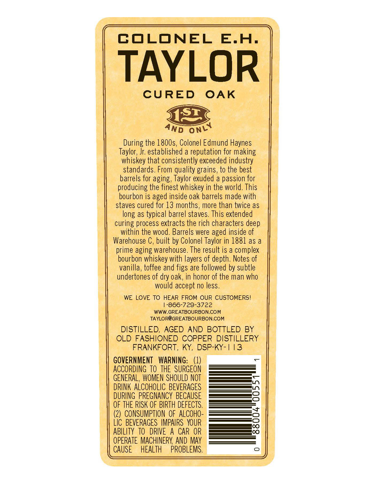
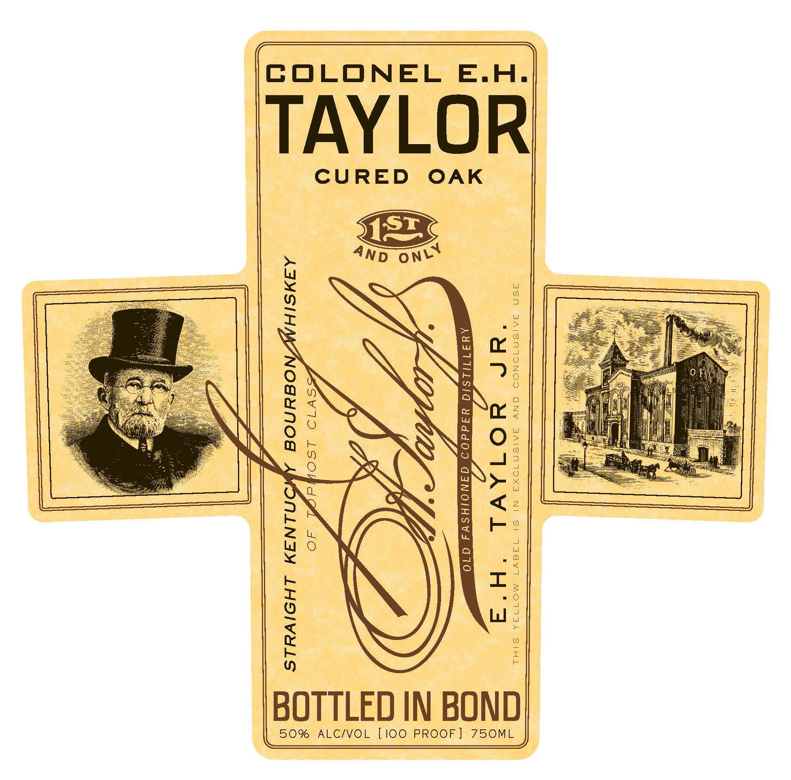
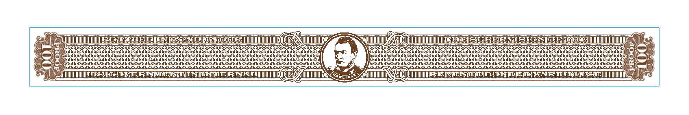

# TTB COLA Label Images - TTBID 14120001000058

**Brand Name:** E. H. TAYLOR

**Fanciful Name:**  

**Issue Date:** 06/11/2014

**Origin Code:** 22

**Product Class/Type:** 101

**Source:** [TTB Public COLA Registry](https://ttbonline.gov/colasonline/viewColaDetails.do?action=publicFormDisplay&ttbid=14120001000058)

## Label Images

### Back Label

### Label 1

### Label 3

## Extracted Label Text

*Text extracted via OCR - may contain errors*

**Detected Proof:** 100

### Back Label

COLONEL
E.H.
TAYLOR
CURED
OAK
ISI
During the 180Os, Colonel Edmund Haynes
Taylor; Jr: established a reputation for making
whiskey that consistently exceeded industry
standards. From guality grains, to the best
barrels for aging, Taylor exuded a passion for
producing the finest whiskey in the world. This
bourbon is aged inside oak barrels made with
staves cured for 13 months, more than twice as
long as typical barrel staves  This extended
curing process extracts the rich characters deep
within the wood. Barrels were aged inside of
Warehouse C, built by Colonel Taylor in 1881 as a
prime aging warehouse. The result is a complex
bourbon whiskey with layers of depth. Notes of
vanilla, toffee and figs are followed by subtle
undertones of dry oak, in honor of the man who
would accept no less.
WE LOVE TO HEAR FROM OUR CUSTOMERS!
-866-729-3722
WWW.GREATBOURBON.COM
TAYLOR@GREATBOURBON.COM
DISTILLED, AGED AND BOTTLED BY
OLD FASHIONED COPPER DISTILLERY
FRANKFORT,
KY, DSP-KY- | 13
GOVERNMENT
WARNING:   (1)
ACCORDING To THE SURGEON
GENERAL, WOMEN SHOULD NOT
DRINK ALCOHOLIC BEVERAGES
DURING   PREGNANCY BECAUSE
OF THE RISK OF BIRTH DEFECTS.
(2)  CONSUMPTION  OF  ALCOHO-
LIc BEVERAGES  IMPAIRS   YOUR
ABILITY  TO   DRIVE
A CAR OR
88
OPERATE MACHINERY  AND MAy
CAUSE
HEALTH
PROBLEMS.
ONLY
AnD

### Label 1

COLONEL E.H.

TAYLOR

CURED OAK

TAYLOR JR.

ERS ¥ Ee Ga SABE LoS: END Ee GEES Wr ABE: COE COLES VE , ERS

Fels

BOTTLED IN BOND

50% ALC/VOL [100 PROOF] 750ML

### Label 3

Ga TUCO See A Se aT a ae eS SIT (Cy NSU UN 2 ea UT SESS ESB) A ST a <4
ats Eb adbdddadsdddndodedhdadosrdrdodddededesrdndndedrdndd cedndrdosudrandodd sadnandnsrdrdedod " Po dudbdedosudbdacesodudosadosnsoca cece duaodacosysecadesecuaodudosudgucesocudodudgsudgeud’ Qi be
fem)lo chaser cecadhcnas cca chasenencadhauabcucads coasauen caches anencndaceanenebcadnaeanatended Y  Wecbes dacs cack cnc du cbes cuca cnchcnes deck decncu ancy doasduatcncbcs cuencnabducbescbencncycndtogel(asyy
Bopp rsicosusucndacednescuseaysussducn cose dysyd cosh cedndecocscyduancnadydncscuemeseayducnced| — Be pesbesdhcbsn deca dhandhescbabsysndndnsndesndysn sh dycndosnseeochensndbandndnduescusbsychdnd Ghee)
ee DE EdEdSrASrdyErsoayEddsrGrerdoeasosyEdcdcnddsedyersosyErcasuardednerseerercrsnGrdy f Ldbde chad doch sucodddocucherddchsncrdrddsecday coed cocodndncucbagencdovcocdddcuchercnedoseos him ={
ma SATII SS Re ES SER SA PCL TTT AU 7 AIM; NES aU) SUT WSs SUT HWS NN SI ITT Bes
