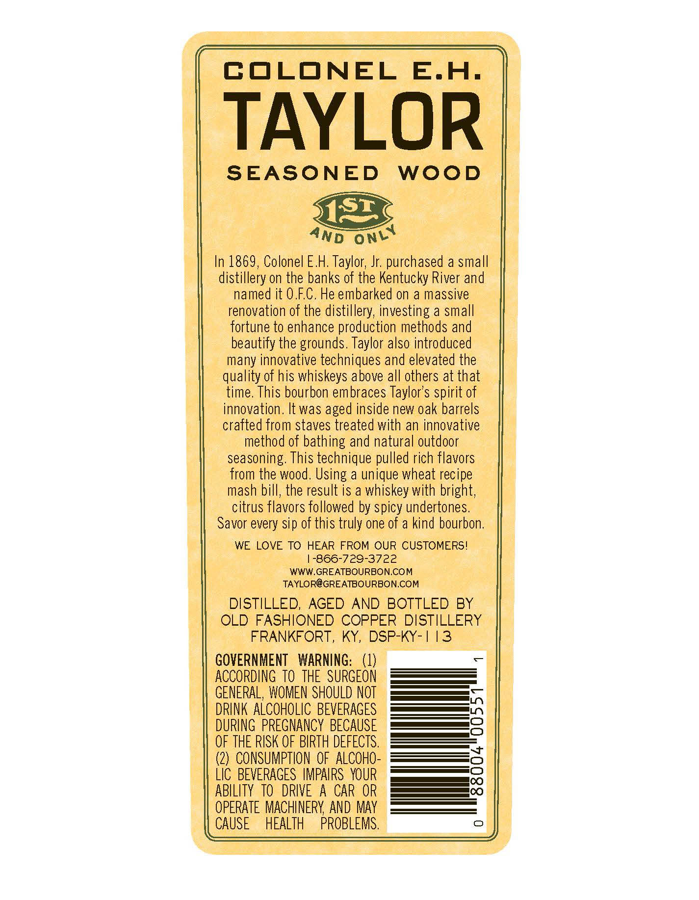
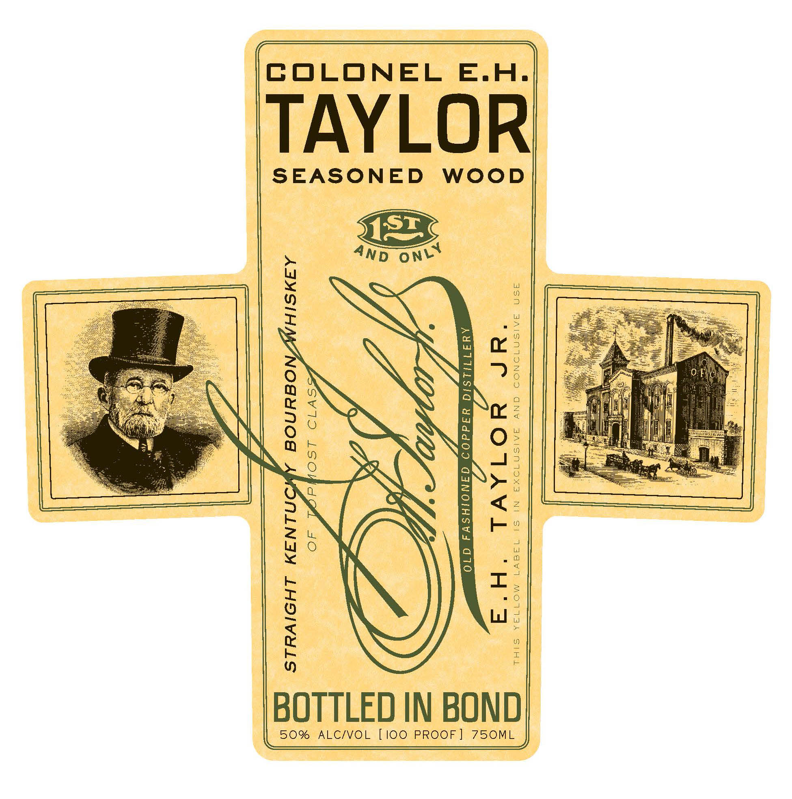
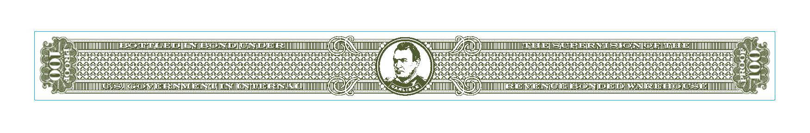

# TTB COLA Label Images - TTBID 14120001000071

**Brand Name:** E.H. TAYLOR

**Fanciful Name:**  

**Issue Date:** 06/11/2014

**Origin Code:** 22

**Product Class/Type:** 101

**Source:** [TTB Public COLA Registry](https://ttbonline.gov/colasonline/viewColaDetails.do?action=publicFormDisplay&ttbid=14120001000071)

## Label Images

### Back Label

### Label 1

### Label 3

## Extracted Label Text

*Text extracted via OCR - may contain errors*

*1 image(s) excluded: text did not meet readability threshold*

### Back Label

COLONEL
E.H.
TAYLOR
SEASONED
WOOD
3132
In 1869, Colonel E.H; Taylor; Jr; purchased a small
distillery on the banks of the Kentucky River and
named it 0.FC. He embarked on a massive
renovation of the distillery; investing a small
fortune to enhance production methods and
beautify the grounds. Taylor also introduced
many innovative techniques and elevated the
quality of his whiskeys above all others at that
time. This bourbon embraces Taylor's spirit of
innovation. It was aged inside new oak barrels
crafted from staves treated with an innovative
method of bathing and natural outdoor
seasoning: This technique pulled rich flavors
the wood . Using a unique wheat recipe
mash bill; the result is a whiskey with bright;,
citrus flavors followed by spicy undertones
Savor every sip of this truly one of a kind bourbon:
WE LOVE TO HEAR FROM OUR CUSTOMERS!
-866-729-3722
WWW.GREATBOURBON.COM
TAYLOR@GREATBOURBON,COM
DISTILLED, AGED AND BOTTLED BY
OLD FASHIONED COPPER DISTILLERY
FRANKFORT ,
KY, DSP-KY-| 13
GOVERNMENT
WARNING:   (1)
ACCORDING TO   THE  SURGEON
GENERAL, WOMEN SHOULD NOT
DRINK ALCOHOLIC BEVERAGES
DURING PREGNANCY BECAUSE
OF THE RISK OF BIRTH DEFECTS.
(2)  CONSUMPTHON oF ALCOHO-
LIc BEVERAGES  IMPAIRS   YOUR
ABILITY  TO   DRIVE
A CAR OR
OPERATE MACHINERY AND May
CAUSE
HEALTH
PROBLEMS
ONLY
AND
from

### Label 3

codococococodecoobco
cocogooooecoodcodogagoco
acordcbcadcco
Jobuco
cbcdocdcoodoco
Uitnn
04605ud84ud6d4dbdhd4abdud84ad64adbdbdba0dud6uud8dudbdbd'
3
cogoco00
Gon
decogocodocooogocodocodoc
60605880db806o83608360do80d88000606o6o605o80d8e0dod36o6o606o
28688866
40084040
04004agodnoodadodha
odoco0400
c00
To
Jdocodnnecunecat
686088
