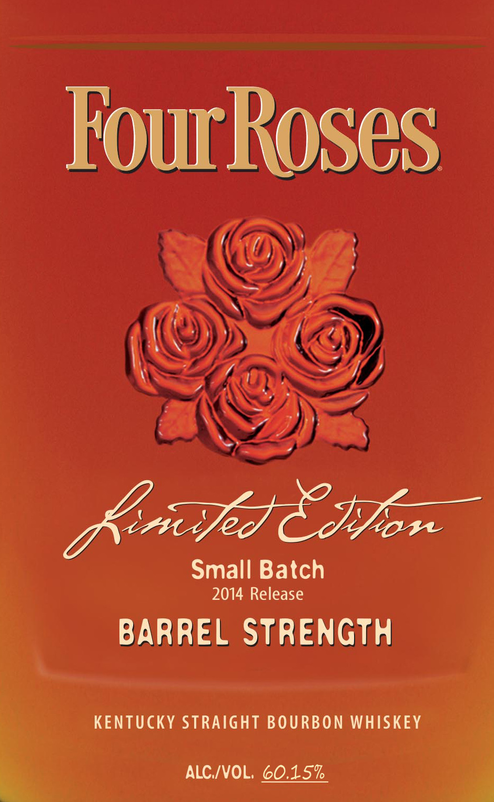
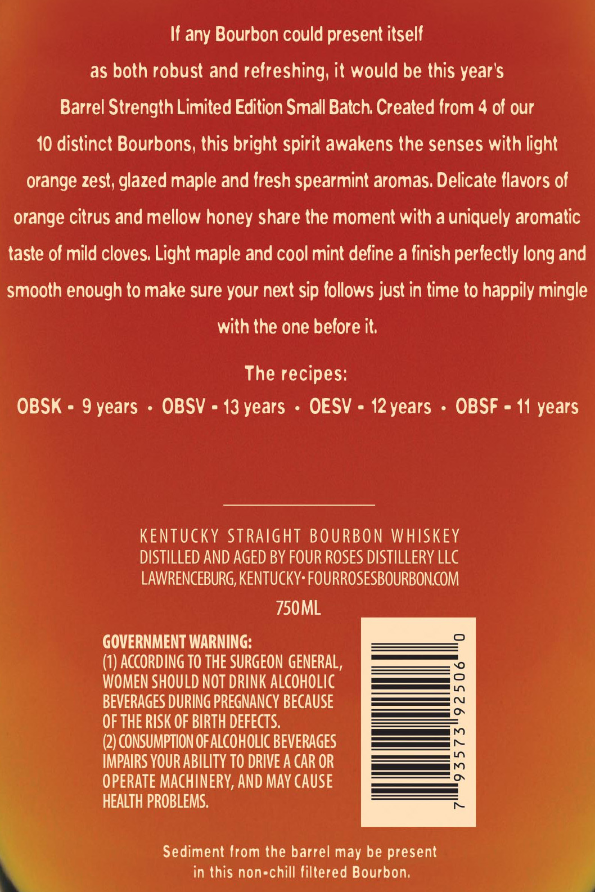
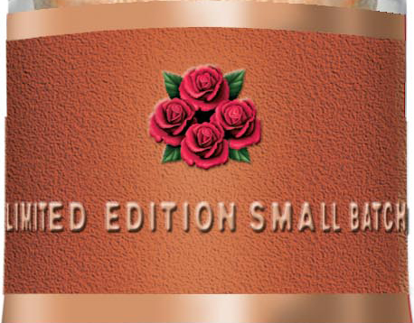

# TTB COLA Label Images - TTBID 14142001000009

**Brand Name:** FOUR ROSES

**Fanciful Name:** LIMITED EDITION SMALL BATCH

**Issue Date:** 06/06/2014

**Origin Code:** 22

**Product Class/Type:** 101

**Source:** [TTB Public COLA Registry](https://ttbonline.gov/colasonline/viewColaDetails.do?action=publicFormDisplay&ttbid=14142001000009)

## Label Images

### Label 1

### Label 2

### Label 3

## Extracted Label Text

*Text extracted via OCR - may contain errors*

### Label 1

Four Roses

\

(ae

DP)

al, 19%),

y

y)

WS)

eZ,

Small Batch

2014 Release

BARREL STRENGTH

KENTUCKY STRAIGHT BOURBON WHISKEY

™

ALC/VOL. 60.15%

### Label 2

If any Bourbon could present itself

as both robust and refreshing, it would be this year's

Barrel Strength Limited Edition Small Batch. Created from 4 of our

10 distinct Bourbons, this bright spirit awakens the senses with light

orange zest, glazed maple and fresh spearmint aromas. Delicate flavors of

orange citrus and mellow honey share the moment with a uniquely aromatic

taste of mild cloves. Light maple and cool mint define a finish perfectly long and

smooth enough to make sure your next sip follows just in time to happily mingle

with the one before it.

The recipes:

OBSK = 9 years - OBSV = 13 years - OESV = 12years - OBSF = 11 years

KENTUCKY STRAIGHT BOURBON WHISKEY

DISTILLED AND AGED BY FOUR ROSES DISTILLERY LLC

LAWRENCEBURG, KENTUCKY: FOURROSESBOURBON.COM

750ML

GOVERNMENT WARNING:

(1) ACCORDING TO THE SURGEON GENERAL,

WOMEN SHOULD NOT DRINK ALCOHOLIC

——= |,

———— or

BEVERAGES DURING PREGNANCY BECAUSE

OF THE RISK OF BIRTH DEFECTS.

————————

(2) CONSUMPTION OF ALCOHOLIC BEVERAGES

IMPAIRS YOUR ABILITY TO DRIVE A CAR OR

OPERATE MACHINERY, AND MAY CAUSE

;

HEALTH PROBLEMS.

Sediment from the barrel may be present

in this non-chill filtered Bourbon,

### Label 3

yOu

WINED EDITION SMALL EITC

hl
