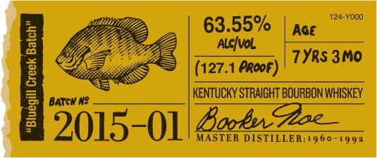
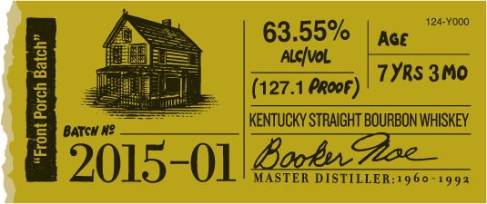
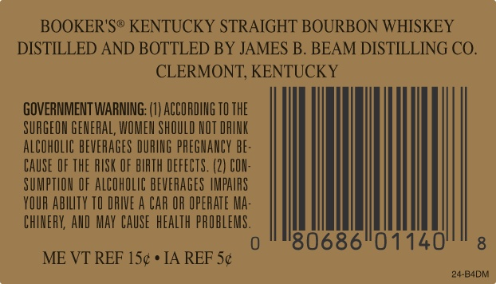
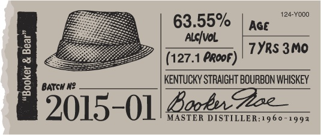
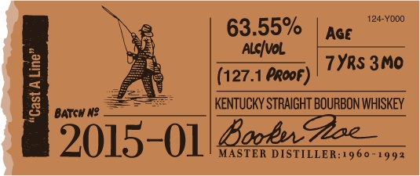
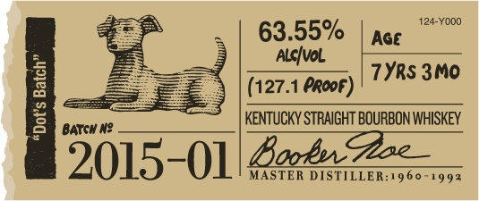
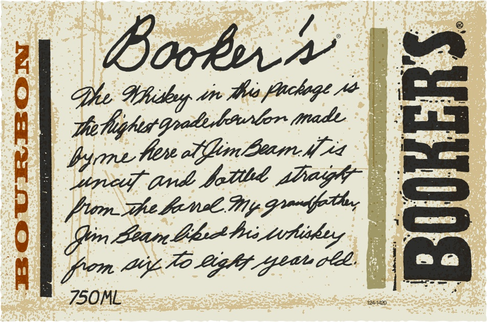
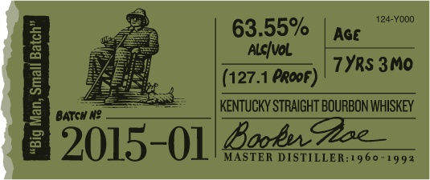
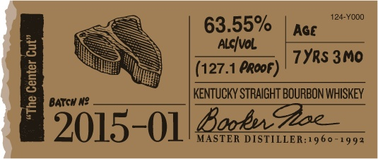

# TTB COLA Label Images - TTBID 14232001000329

**Brand Name:** BOOKER'S

**Fanciful Name:**  

**Issue Date:** 08/25/2014

**Origin Code:** 22

**Product Class/Type:** 101

**Source:** [TTB Public COLA Registry](https://ttbonline.gov/colasonline/viewColaDetails.do?action=publicFormDisplay&ttbid=14232001000329)

## Label Images

### Back Label

### Front Label

### Label 10

### Label 2

### Label 3

### Label 4

### Label 5

### Label 6

### Label 7

### Label 9

## Extracted Label Text

*Text extracted via OCR - may contain errors*

### Back Label

63.55%

a

(127.1 Proof)

KENTUCKY STRAIGHT BOURBON WHISKEY

2015-01 MASTER DISTILLER:1960-1992

### Front Label

63.55%

i

(127.1 PRooF)

KENTUCKY STRAIGHT BOURBON WHISKEY

5015-01 MASTER DISTILLER:19 60-1992

### Label 10

BOOKER'S® KENTUCKY STRAIGHT BOURBON WHISKEY

DISTILLED AND BOTTLED BY JAMES B. BEAM DISTILLING CO.

CLERMONT, KENTUCKY

GOVERNMENT WARNING: (1) ACCORDING 10 THE

SURGEON GENERAL, WOMEN SHOULD NOT DRINK

ALCOHOLIC BEVERAGES DURING PREGNANCY BE

CAUSE OF THE RISK OF BIRTH DEFECTS. (2) CON

SUMPTION OF ALCOHOLIC BEVERAGES IMPAIRS

YOUR ABILITY T0 DRIVE A CAR OR OPERATE MA:

CHINERY, AND MAY CAUSE HEALTH PROBLEMS

0

Ul

ME VT REF 15¢ * JA REF 5:

24-B4DM

### Label 2

63.55%

(127.1 Proof)

Kooba: RAIGHT BOURBON WHISKEY

9015-01 4x4 MASTER DISTILLER:19 60-1992

### Label 3

63.55%

|

(127.1 Proof)

KENTUCKY STRAIGHT BOURBON WHISKEY

5015-01 MASTER DISTILLER:1960-1992

### Label 4

124-Yoo0

63.55%

TYRS 3M0

(127.1 Proof)

Kooba RAIGHT BOURBON WHISKEY

2015-01 dee.

### Label 5

booker

le. Whitleyy viv thea flochege 2

aie Co

trade \ Ell

role

wpe (rd betd phagh

fen pee Lew, Wy Grane,

Bean bbicttis, turing

i

750ML

### Label 6

63.55%

(127.1 Proof)

Rood RAIGHT BOURBON WHISKEY

‘5015-01 Garé MASTER DISTILLER: 1960-1992

### Label 7

63.55%

(127.1 Proof)

KENTUCKY STRAIGHT BOURBON WHISKEY

5015-01 MASTER DISTILLER:1960-1992

### Label 9

»—~
