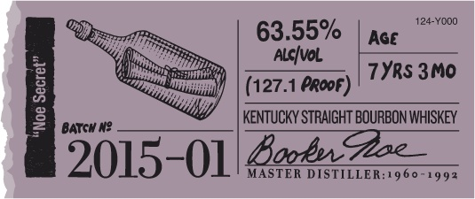
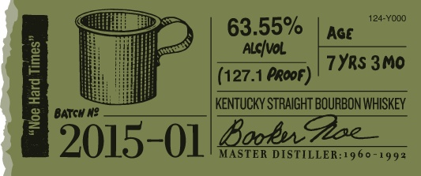
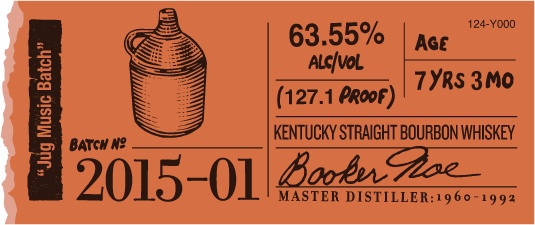
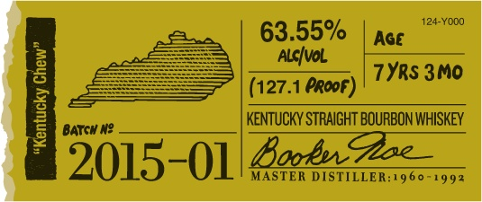
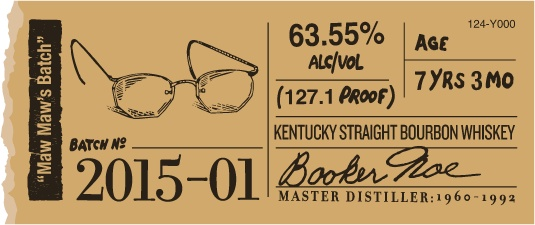
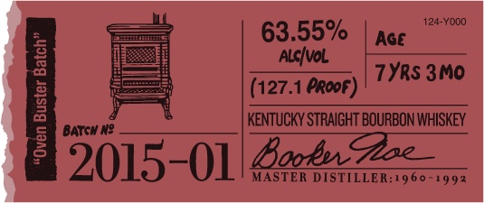
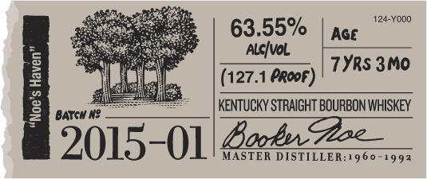

# TTB COLA Label Images - TTBID 14232001000331

**Brand Name:** BOOKER'S

**Fanciful Name:**  

**Issue Date:** 08/25/2014

**Origin Code:** 22

**Product Class/Type:** 101

**Source:** [TTB Public COLA Registry](https://ttbonline.gov/colasonline/viewColaDetails.do?action=publicFormDisplay&ttbid=14232001000331)

## Label Images

### Label 1

### Label 10

### Label 2

### Label 3

### Label 4

### Label 5

### Label 6

### Label 7

### Label 8

### Label 9

## Extracted Label Text

*Text extracted via OCR - may contain errors*

*1 image(s) excluded: text did not meet readability threshold*

**Detected Proof:** 127.1
**Detected Age:** 7 Years

### Label 1

124-YOOO
63.55%
Age
Alcivol
1
(127.1 PRopF]
7YRS 3M0
8
BATCH N?
KenTuCKY STRAIGHT BOURBON WHISKEY
2015-01/ Bag2z
MASTER DISTILLER:1960-1992

### Label 10

BOOKER'Se KENTUCKY STRAIGHT BOURBON WHISKEY
DISTILLED AND BOTTLED BY JAMES B. BEAM DISTILLING CO.
CLERMONT, KENTUCKY
GOVERNMENT WARNING:
ACCORDING TO THE
SURGEOH GENERAL; WOMEN ShOULD NOT DRIHK
AlCOhOlIC BEVERAGES DURING PREGHAHCY be:
CAuSe OF the RISK €F BIRTH DEFECTS. (2} CON
SUMPTLOH €F ALCOhOLIc BEVERAGES IMPAIRS
YOUR AbIlTY TO DRIVE
Car OR OPERATE Ma:
CHIHERK AnD  MaY CAuSe health pROBLEMS .
'80686"01140'
ME VT REF 1Sc
IA REF Sc
24-BADM

### Label 2

124-YOdO
63.55%
Age
AlcIval
7YRS 3M0
(127.1 PRopf)
J
BaTGH N?
KeNTuCKY STRAIGHT BOURBON WHISKEY
2015-01/82522z
MASTER DISTILLER:1960 -
992

### Label 3

124-YOOO
63.55%
Age
3
AlcIvol
7YRS 3M0
(127.1 PRopF]
1
KenTUCKY STRAIGHT BOURBON WHISKEY
BATCH N?
52015-01/ Ba4.z.
MASTER DISTILLER:960-1992

### Label 4

124-YOOO
63.55%
Age
3
Alcfvol
7YRS 3M0
(127.1 PRopF]
1
BATCH N?
KenTUCKY STRAIGHT BOURBON WHISKEY
2015-01/ BaE22
MASTER DISTILLER:1960-1992

### Label 5

124-YOOO
63.55%
Age
3
Alcfvol
7YRsS 3M0
(127.1 PRopF]
3
KenTUCKY STRAIGHT BOURBON WHISKEY
BATCH N?
12015-01/Bo6nz
MASTER DISTILLER:1960-1992

### Label 6

124-YOOO
63.55%
Age
3
AlcIval
7YRS 3M0
(127.1 PRoDF}
3
KeNTuCKY STRAIGHT BOURBON WHISKEY
BATCH N?
12015-01/8a6n2  _
MASTER DISTILLER:1960-1992

### Label 7

BBookeh
e
mn Hls plackage_
Theflghut-gpadebsuNor aad
1
Z12
1
ZhBemnel
IAthw
Oom Zeam Exsta etudry
Zuy%o elgft
022.
Z50ML
44
Ifisbt ~
my=
~eeay
fon

### Label 8

124-YdOO
63.55%
Age
Alcfvol
1
(127.1 PRopF]
7YRS 3MO
3
BATCH N?
KenTuCKY STRAIGHT BOURBON WHISKEY
2015-01/ BaE22
MASTER DISTILLER:1960-1992
