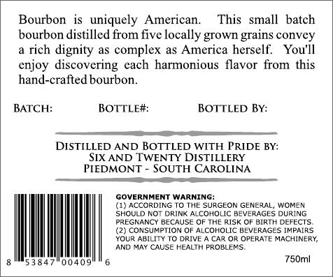
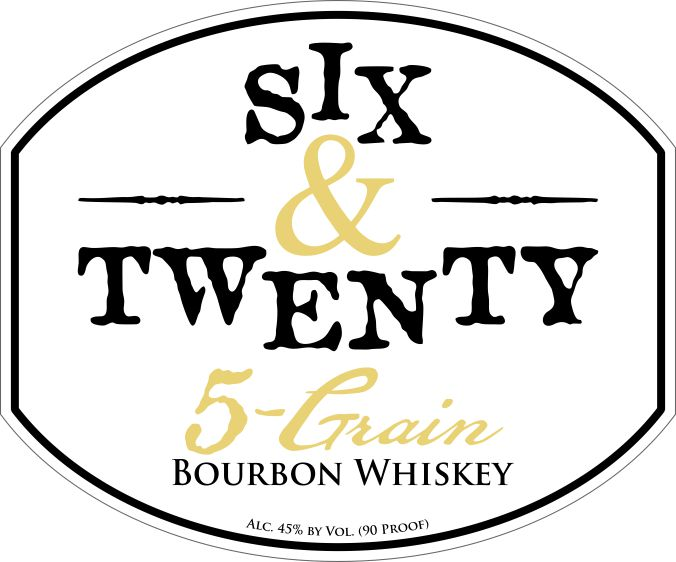

# TTB COLA Label Images - TTBID 14234001000251

**Brand Name:** SIX AND TWENTY

**Fanciful Name:** BOURBON

**Issue Date:** 11/03/2014

**Origin Code:** 41

**Product Class/Type:** 141

**Source:** [TTB Public COLA Registry](https://ttbonline.gov/colasonline/viewColaDetails.do?action=publicFormDisplay&ttbid=14234001000251)

## Label Images

### Back Label

### Front Label

## Extracted Label Text

*Text extracted via OCR - may contain errors*

### Back Label

Bourbon  is  uniquely
American.
This
Small   batch
bourbon distilled from five locally grown grains convey
rich dignity as complex as America herself:
You']I
enjoy discovering cach
harmonious
from this
hand-crafted bourbon.
BATCH:
BOTTLE#:
BOTTLED By:
DISTILLED AND BOTTLED WITH PRIDE BY:
SIX AND [ WENTY DISTILLERY
PIEDMONT
SOUTH CAROLINA
GOVERNMENT WARNING:
(1) ACCORDING 10 THE SURGEON GENERAL, WOMEN
SHOULD NO
DRINK ALCOHOLIC BEVERAGES OURING
PREGNANCY BECAUSE 0F THE RISK OF BIRTH DEFECIS
CONSUMPIION OF ALCOHOUC BEVERAGES IHPAIRS
YOUR ABILIY T0 DRIVE
CAR OR OPERATE MACHINERY,
AND MAY CAUSE HEALIH PROBLERS
00409
750ml
flavor

### Front Label

six we
TWENTY
Ab Ln Ltr

BOURBON WHISKEY
