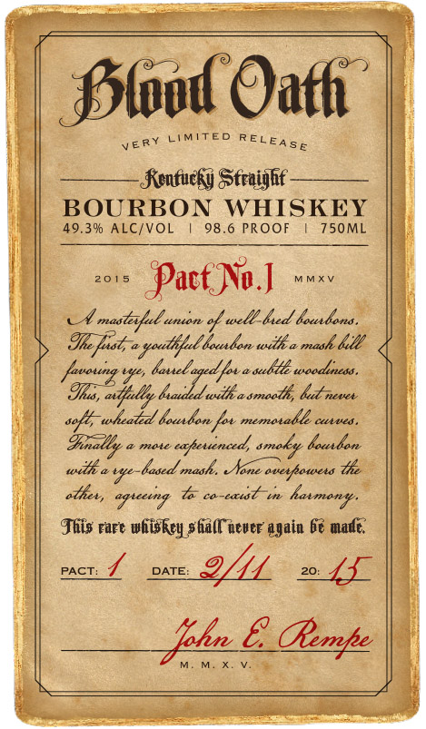

# TTB COLA Label Images - TTBID 14261001000322

**Brand Name:** BLOOD OATH

**Fanciful Name:**  

**Issue Date:** 10/26/2014

**Origin Code:** 29

**Product Class/Type:** 101

**Source:** [TTB Public COLA Registry](https://ttbonline.gov/colasonline/viewColaDetails.do?action=publicFormDisplay&ttbid=14261001000322)

## Label Images

### Back Label

### Front Label

## Extracted Label Text

*Text extracted via OCR - may contain errors*

### Back Label

C

MMXY

### Front Label

==

=

Se

a

| Prood Oath:

very LIMITED RELe ga,

4

Fontueky Straight

BOURBON WHISKEY

| 49.3% ALC/VOL | 98.6 PROOF | 750ML

Ve

i

2018 Pact No mmxy

| @

Mince of ial Nasel deastdea

i

Thefshea youl

Ld haben witha raat

Mh

aaublle wooduuess, —

oa

rire PEI

cence Ne aoe

De ZR BE oe,

Dias ames tgleioicd omee Mae

Te

|

other, agicaing te concstst tn harmony.

Wy

This rare whiskey stid(C never again Ge made,

pact. L

DATE:

aif

te Oe

M.M.X. Vv.

i
