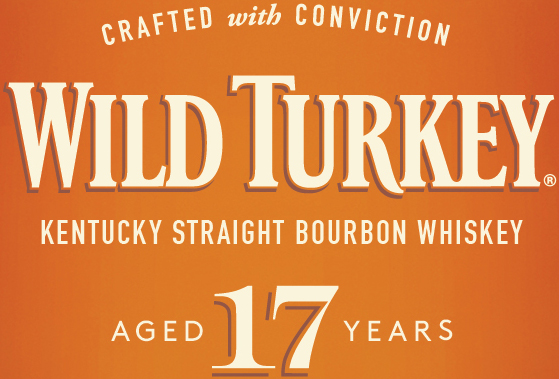
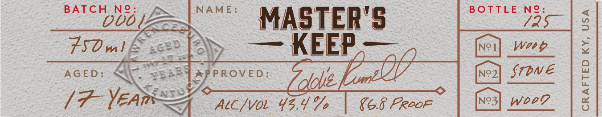
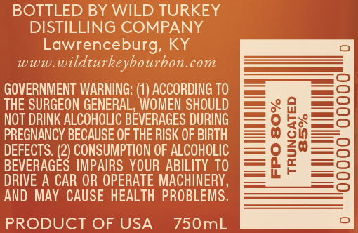

# TTB COLA Label Images - TTBID 14352001000297

**Brand Name:** WILD TURKEY

**Fanciful Name:** MASTER'S KEEP

**Issue Date:** 02/12/2015

**Origin Code:** 22

**Product Class/Type:** 101

**Source:** [TTB Public COLA Registry](https://ttbonline.gov/colasonline/viewColaDetails.do?action=publicFormDisplay&ttbid=14352001000297)

## Label Images

### Front Label

### Label 1

### Label 3

### Label 4

### Label 5

## Extracted Label Text

*Text extracted via OCR - may contain errors*

*2 image(s) excluded: text did not meet readability threshold*

### Front Label

Wid TuRkEY
KENTUCKY STRAIGHT BOURBON WHISKEY
AGED
1
YEARS
with
conviction
CRAFTED

### Label 1

BATCH
Ne
NAME:
BOTTLE
Ne
Ouo
MASTER'S
3
Zsvml
KEEP
Ne]
Wo'
2
AGED:
PPROvED
Id
N?2
Stbne
17-YeAn
Aicivo {Zdoe
{6.8 Prdof
N?3
Wdev
1
G52
4625
324S
4

### Label 3

BOTTLED BY WILD TURKEY
DISTILLING COMPANY
Lawrenceburg, KY
Www
wildturkeybourbon.com
GOVERNMENT WARNING:
ACCORDING TO
THE SURGEON GENERAL,WOMEN SHOULD
NOT DRINK ALCOHOLIC BEVERAGES DURING
88
PREGNANCY BECAUSE OF THE RISK OF BIRTH
DEFECTS. (2) CONSUMPTION OF ALCOHOLIC

BEVERAGES IMPAIRS YOUR ABILITY TO
2
DRIVE A CAR OR OPERATE MACHINERY,
AND MAY CAUSE HEALTH PROBLEMS.
PRODUCT OF USA
750mL
