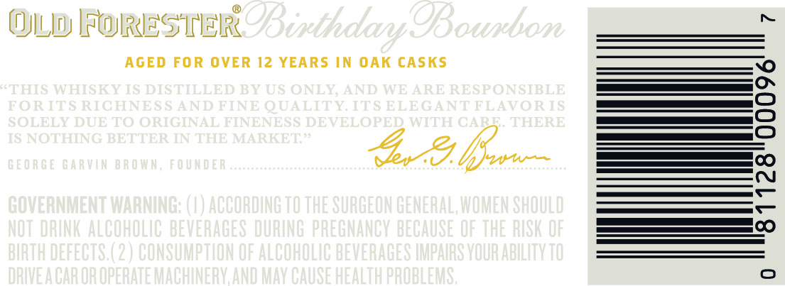
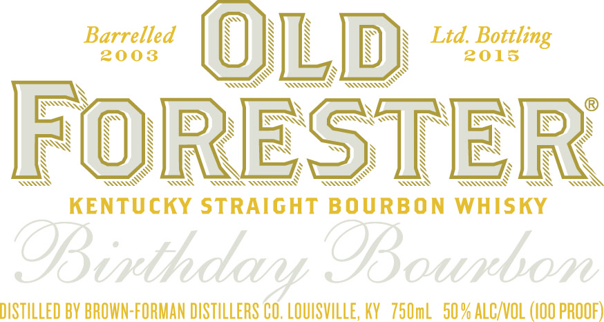
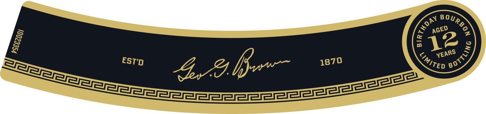

# TTB COLA Label Images - TTBID 15047001000249

**Brand Name:** OLD FORESTER

**Fanciful Name:** BIRTHDAY BOURBON

**Issue Date:** 03/25/2015

**Origin Code:** 22

**Product Class/Type:** 101

**Source:** [TTB Public COLA Registry](https://ttbonline.gov/colasonline/viewColaDetails.do?action=publicFormDisplay&ttbid=15047001000249)

## Label Images

### Back Label

### Label 1

### Label 3

### Label 4

### Label 5

## Extracted Label Text

*Text extracted via OCR - may contain errors*

*2 image(s) excluded: text did not meet readability threshold*

**Detected Age:** 12 Years

### Back Label

OLD FokESTER
E9Bithdany OBounbon
AGED FOR OVER 12 YEARS
N OAK cASKS
FTHIS WHISEY IS DISTILLED BY US ONLY
AND WE ARE RESPONSIBLE
FORITS RICHNES $ AND FINE QUALITY ITS ELE GANT FLAVORIS
1
SOLELY DUE TO ORIGINAL FINENESS DEVELOPED WITH CART
THERE
TS NOTHING BETTER IN THE MARKET'
G E 0 R G E Ga RVin BRO WN, Fo UN D E R
8
GOVERMMNENT UMARMING;
ACCORDING TO THE SURGEON GENERAL,WOMEN SHOULD
NOT DRUNK ALCOHOLAC BEVERAGES DURUNG PREGMANGV BECAUSE OF THE RUSK OF
5
BIRTH DEFECTS (2 ) CONSUMPTHON OF ALCOHOLIC BEVERAGES HMPAURS VOUR ABILITV TO
DRIEACAR OR OPERATE MUACHUNERV AND MAV CAUSE HEALTH PROBLEMS ;

### Label 1

Baoelled
(LD
Ltd_Bottl
Bottling
FORESTER
KENTUCKY STRAIGHT
BOURBON WHISKY
@Binthdary OBounbon
DISTILLED BV BROWN-FORMAN DISTILLERS CO, LOUISVILLE, KV   750mL  505
ALCNOL (I0O PROOF)

### Label 3

AGED
12
r
YEARS
DAY
)
{
ROTTLING
IMITED
