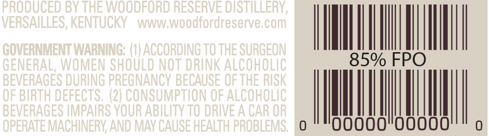
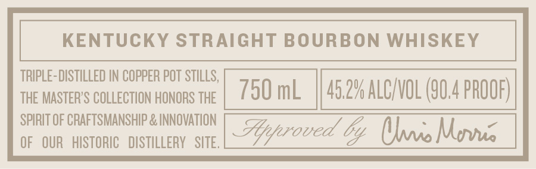
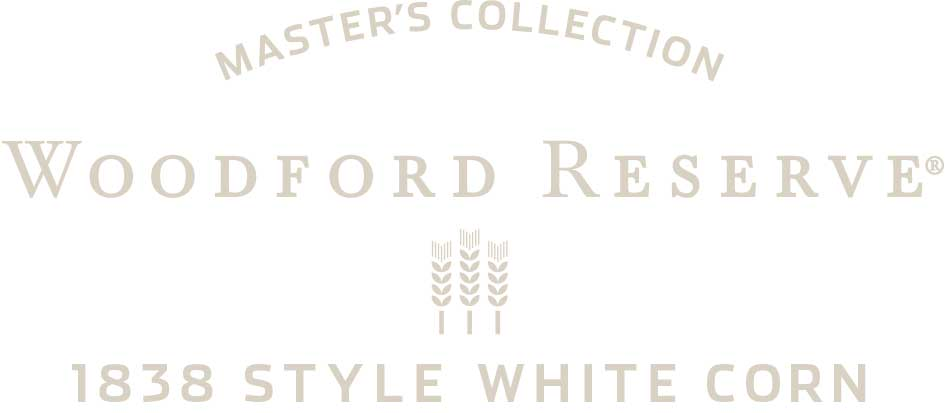
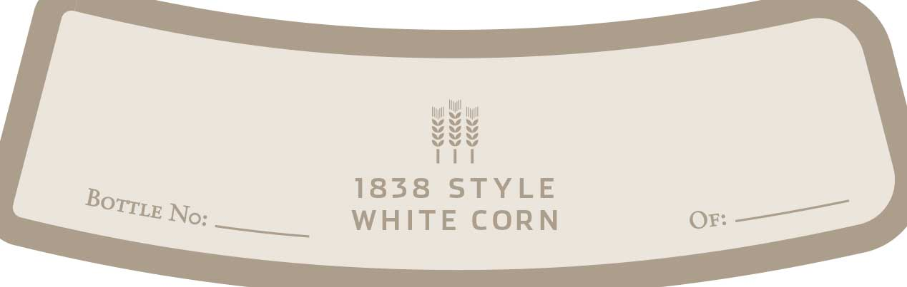
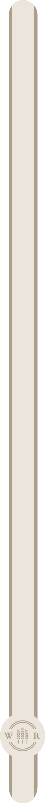

# TTB COLA Label Images - TTBID 15070001000108

**Brand Name:** WOODFORD RESERVE

**Fanciful Name:** MASTER'S COLLECTION 1838 WHITE CORN

**Issue Date:** 04/21/2015

**Origin Code:** 22

**Product Class/Type:** 101

**Source:** [TTB Public COLA Registry](https://ttbonline.gov/colasonline/viewColaDetails.do?action=publicFormDisplay&ttbid=15070001000108)

## Label Images

### Back Label

### Label 1

### Label 2

### Label 4

### Label 5

## Extracted Label Text

*Text extracted via OCR - may contain errors*

*2 image(s) excluded: text did not meet readability threshold*

### Label 1

KENTUCKY STRAIGHT BOURBON WHISKEY

TRIPLE- DISTILLED IN COPPER POT STILLS,

THE MASTER'S COLLECTION HONORS THE

750 mL | 45.2% ALCIVOL (G04 PROOF)

SPIRIT OF CRAFTSMANSHIP & INNOVATION

OF OUR HISTORIC DISTILLERY SITE.

Hyroved by Yaa Morne

### Label 2

pSTER’s COLLECT,

WOODFORD RESERVE®

wi

Ai

¥ il

wey

WAV AA

III

1838 STYLE WHITE CORN

### Label 4

iu

a

Vee

Vue

PTT

1838 STYLE

Borri No:

WHITE CORN

Or: — _
