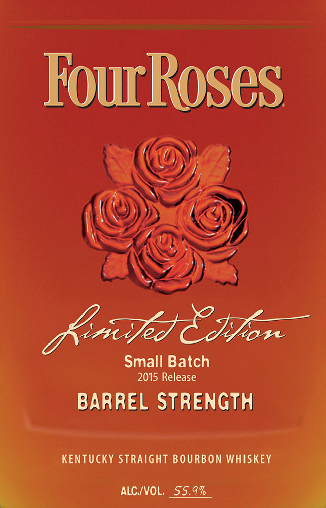
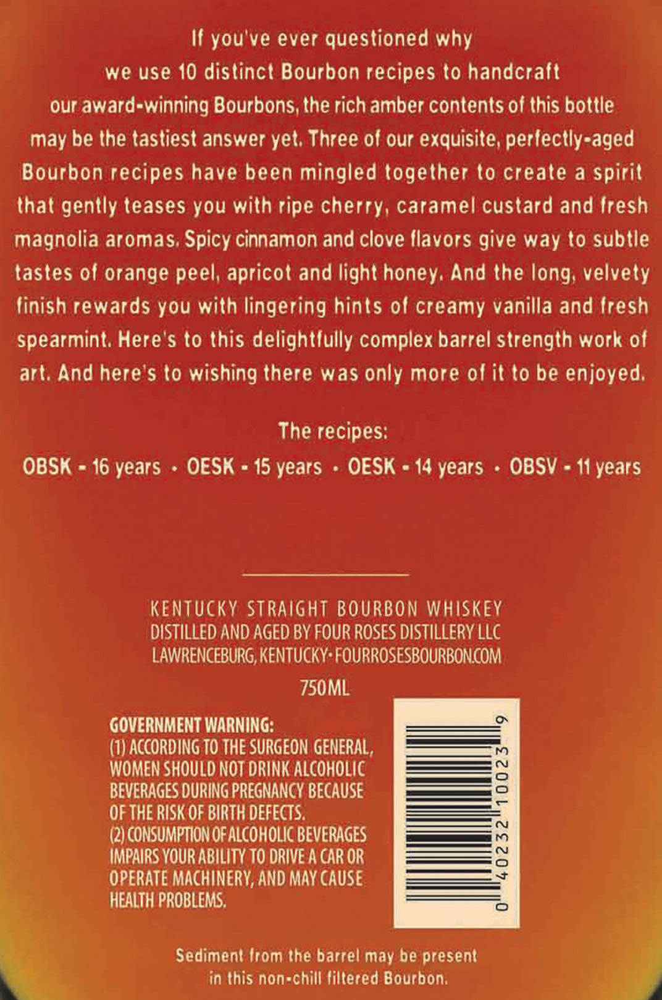
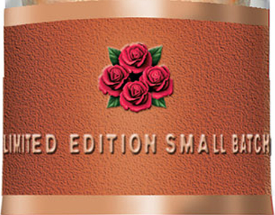

# TTB COLA Label Images - TTBID 15077001000085

**Brand Name:** FOUR ROSES

**Fanciful Name:** LIMITED EDITION SMALL BATCH

**Issue Date:** 04/21/2015

**Origin Code:** 22

**Product Class/Type:** 101

**Source:** [TTB Public COLA Registry](https://ttbonline.gov/colasonline/viewColaDetails.do?action=publicFormDisplay&ttbid=15077001000085)

## Label Images

### Label 1

### Label 2

### Label 3

## Extracted Label Text

*Text extracted via OCR - may contain errors*

### Label 1

a (A)
—n
Kidd Cen
Small Batch
BARREL STRENGTH
KENTUCKY STRAIGHT BOURBON WHISKEY
4 ALC/VOL, 55.9% al

### Label 2

If you've ever questioned why

we use 10 distinct Bourbon recipes to handcraft

our award-winning Bourbons, the rich amber contents of this bottle

may be the tastiest answer yet, Three of our exquisite, perfectly-aged

Bourbon recipes have been mingled together to create a spirit

that gently teases you with ripe cherry, caramel custard and fresh

magnolia aromas, Spicy cinnamon and clove flavors give way to subtle

tastes of orange peel, apricot and light honey. And the long, velvety

finish rewards you with lingering hints of creamy vanilla and fresh

Spearmint. Here's to this delightfully complex barrel strength work of

art. And here's to wishing there was only more of it to be enjoyed

The recipes

OBSK = 16 years - OESK = 15 years - OESK = 14 years - OBSV - 11 years

KENTUCKY STRAIGHT BOURBON WHISKEY

DISTILLED AND AGED BY FOUR ROSES DISTILLERY LLC

LAWRENCEBURG, KENTUCKY: FOURROSESBOURBON.COM

750ML

GOVERNMENT WARNING:

(1) ACCORDING TO THE SURGEON GENERAL

WOMEN SHOULD NOT DRINK ALCOHOLIC

=—— —

—=—=

BEVERAGES DURING PREGNANCY BECAUSE

OF THE RISK OF BIRTH DEFECTS.

CONSUMPTION OF ALCOHOLIC BEVERAGES

IMPAIRS YOUR ABILITY TO DRIVE A CAR OR

OPERATE MACHINERY, AND MAY CAUSE

HEALTH PROBLEMS,

Sediment from the barrel may be present

in this non-chill filtered Bourbon

### Label 3

yOu

WED EDITION SMALL BCR
