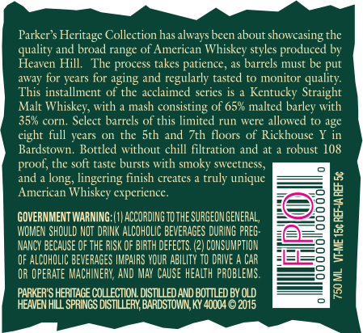
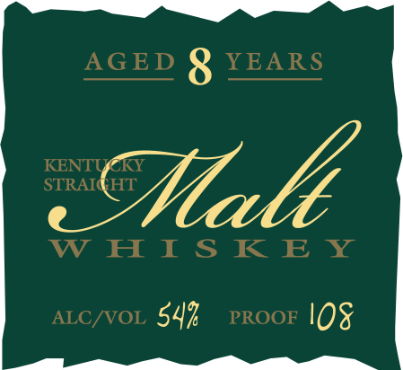

# TTB COLA Label Images - TTBID 15114001000069

**Brand Name:** PARKER'S HERITAGE COLLECTION

**Fanciful Name:** KENTUCKY STRAIGHT MALT

**Issue Date:** 05/15/2015

**Origin Code:** 22

**Product Class/Type:** 149

**Source:** [TTB Public COLA Registry](https://ttbonline.gov/colasonline/viewColaDetails.do?action=publicFormDisplay&ttbid=15114001000069)

## Label Images

### Back Label

### Front Label

## Extracted Label Text

*Text extracted via OCR - may contain errors*

*1 image(s) excluded: text did not meet readability threshold*

**Detected Proof:** 108

### Back Label

Parker's Heritage Collection has always been about showcasing the
quality and broad range of American Whiskey styles produced by
Heaven Hill, ‘The process takes patience, as barrels must be put
away for years for aging and regularly tasted to monitor quality

This installment of the acclaimed series is a Kentucky Straight
Malt Whiskey, with a mash consisting of 65% malted barley with
35% corn, Select barrels of this limited run were allowed to age
ight full years on the 5th and 7th floors of Rickhouse Y in
Bardstown, Bottled without chill filtration and at a robust 108
proof, the soft taste bursts with smoky sweetnes
and a long, lingering finish creates a truly unique
American Whiskey experience.

GOVERNMENT WARNING: (1) ACCORDING TO THE SURGEON GENERAL,
WOMEN SHOULD NOT DRINK ALCOHOLIC BEVERAGES DURING PREG-
NANCY BECAUSE OF THE RISK OF BIRTH DEFECTS. (2) CONSUMPTION
OF ALCOHOLIC BEVERAGES IMPAIRS YOUR ABILITY TO DRIVE A CAR
OR OPERATE MACHINERY, AND MAY CAUSE HEALTH PROBLEMS.

PARKER'S HERITAGE COLLECTION. DISTILLED AND BOTTLED BY OLD
HEAVEN HILL SPRINGS DISTILLERY, BARDSTOWN, KY 40004 © 2015

_ ewe ewe TOS

750 ML VME 15¢ REFIAREF5¢
