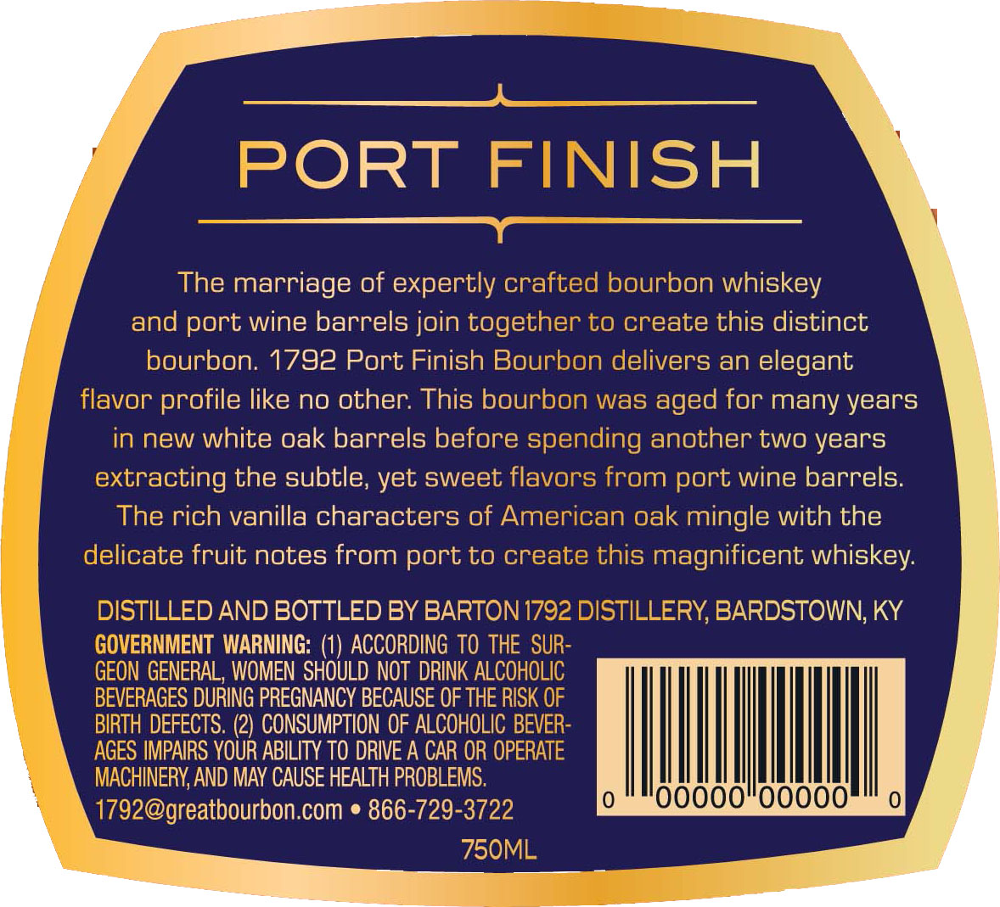
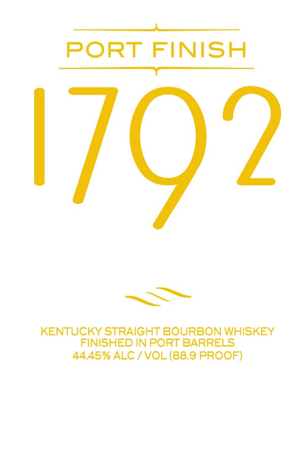

# TTB COLA Label Images - TTBID 15119001000484

**Brand Name:** 1792

**Fanciful Name:**  

**Issue Date:** 05/26/2015

**Origin Code:** 22

**Product Class/Type:** 101

**Source:** [TTB Public COLA Registry](https://ttbonline.gov/colasonline/viewColaDetails.do?action=publicFormDisplay&ttbid=15119001000484)

## Label Images

### Back Label

### Label 1

## Extracted Label Text

*Text extracted via OCR - may contain errors*

**Detected Proof:** 88.9

### Back Label

aaa 2 =
y —— =e y
y ‘
A >) cr =a 7 = = Y
y PORT | ISH 2
== a Y \
y . Y
y The marriage of expertly crafted bourbon whiskey \
and port wine barrels join together to create this distinct \
bourbon. 1792 Port Finish Bourbon delivers an elegant \
flavor profile like no other. This bourb vas aged for many years J |
in new white oak barrels before s; ling another two years |
extracting the subtle, yet sweet flavors from port wine barrels. |
The rich vanilla characters of American oak mingle with the |
lelicate fruit notes from port to create this magnificent whiskey.
ISTILLED AND BOTTLED BY BARTON ISTILLERY, BARDSTOWN, KY
| VERNMENT WARNING: (1) ACCORDING TO THE SUR |
GEON GENERAL, WOMEN SHOULD NOT DRINK ALCOHOLIC PTW Tht line =f
EVERAGES DURING PREGNANCY BECAUSE OF THE RISK OF |
BIRTH DEFECTS. (2) CONSUMPTION OF ALCOHOLIC BEVE |
3ES IMPAIRS YOUR ABILITY TO DRIVE A CAR OR OPERATE
\ MACHINERY, AND MAY CAUSE HEALTH PROBLEMS. Re ie
\ 1792@greatbourbon.com * 866-729-3722 bat SS eat

### Label 1

——
PORT FINISH
Pe att Aes i
KENTUCKY STRAIGHT BOURBON WHISKEY
FINISHED IN PORT BARRELS
44.45% ALC / VOL (88.9 PROOF)
