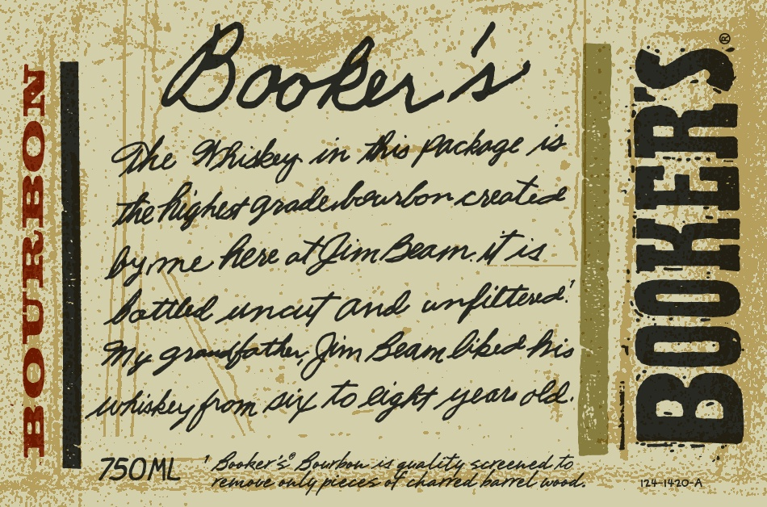
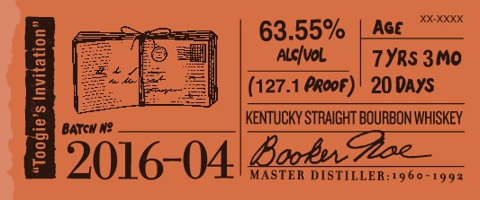

# TTB COLA Label Images - TTBID 15216001000271

**Brand Name:** BOOKER'S

**Fanciful Name:**  

**Issue Date:** 08/24/2015

**Origin Code:** 22

**Product Class/Type:** 101

**Source:** [TTB Public COLA Registry](https://ttbonline.gov/colasonline/viewColaDetails.do?action=publicFormDisplay&ttbid=15216001000271)

## Label Images

### Label 1

### Label 2

### Label 3

### Label 4

## Extracted Label Text

*Text extracted via OCR - may contain errors*

*2 image(s) excluded: text did not meet readability threshold*

### Label 1

booker

Bho Wibuy tm shea frchege Ae

(es

mila

Satta sper tds ur fll

Wy rm o lin Loan bh his

eee, || == |

PEN LES epens

s<¢e

barrel tured.

cened jlo .

### Label 4

BOOKER'S® KENTUCKY STRAIGHT BOURBON WHISKEY

DISTILLED AND BOTTLED BY JAMES B. BEAM DISTILLING CO.

CLERMONT, KENTUCKY

GOVERNMENT WARNING: (1) ACCORDING 10 THE

SURGEON GENERAL, WOMEN SHOULD NOT DRINK

ALCOHOLIC BEVERAGES DURING PREGNANCY BE

CAUSE OF THE RISK OF BIRTH DEFECTS. (2) CON

SUMPTION OF ALCOHOLIC BEVERAGES IMPAIRS

YOUR ABILITY T0 DRIVE A CAR OR OPERATE MA:

CHINERY, AND MAY CAUSE HEALTH PROBLEMS

0

Ul

ME VT REF 15¢ * JA REF 5:

24-B4DM
