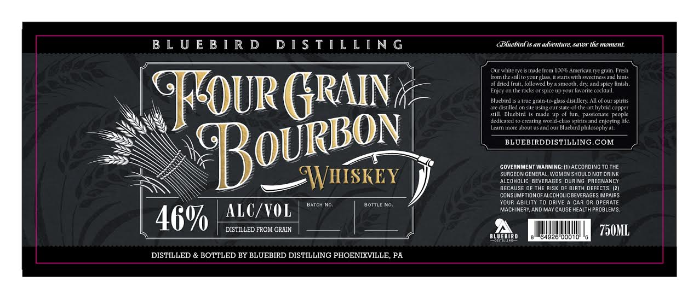

# TTB COLA Label Images - TTBID 15226001000399

**Brand Name:** BLUEBIRD DISTILLING

**Fanciful Name:** BLUEBIRD DISTILLING

**Issue Date:** 09/02/2015

**Origin Code:** 39

**Product Class/Type:** 141

**Source:** [TTB Public COLA Registry](https://ttbonline.gov/colasonline/viewColaDetails.do?action=publicFormDisplay&ttbid=15226001000399)

## Label Images

### Label 1

## Extracted Label Text

*Text extracted via OCR - may contain errors*

**Detected Proof:** 92

### Label 1

B L U E B / R D
D I $ TIL L [ N G
(Bluebin 1S 4n adientun,sVor the momtent
Ourwhite rye ts made lrom Ioox Americanrye gtain Fresh
fromthe stilltoyourglass
Eanenntancnesandhinis
dricd Irult_ lollowedby
stooth; dry and spicy Iinish.
Enjoy on tlc tok
spice up your lavorite cerkail
GFEOUR GRAIn-
Bleebsridles otse
sftetsingo,
UTssaidistHleeyaXthgboud coprics
Still, Bluchird
Tade
of fun
Dasfanale
people
dedicuted
creating rorld
pnts Inc
enjoying Iile
Learn mone about us atdl our Bluebird philosuphya7:
BLUEBIRDDISTILLING COM
GOVERNMENT WARNING;
Accoadingto the
WWHISKEY
SuageoN GENERAL, WOMEN SHOULD NOT ORINK
Alcoholic BeveRAGES during PREGNANCY
BECAUSE OF THE Risk OF BiRTH DEFECTS. (21
CONSUMPTION OFALCOHOLICBEVERAGES IMPAIRS
BaTcH No
BotTLe No,
Your ABILITY to drive
Car Or OperatE
ALC/VOL
MACHINERY, AND MAY CAUSE HEALTH PROBLEMS
46%
DISTILLED FROM GRHN
750ML
BLUEBIRD
64926" O0d10"
DISTILLED & BOTTLED BY BLUEBIRD DISTILLING PHOENLXVILLE; PA
Bourbov
ls
