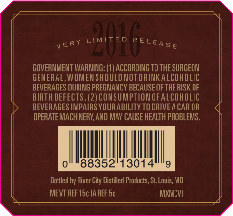
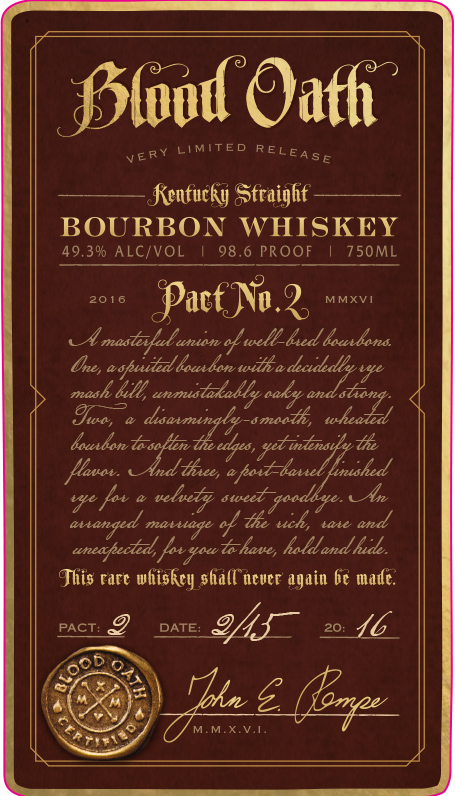
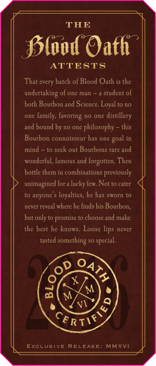

# TTB COLA Label Images - TTBID 15244001000320

**Brand Name:** BLOOD OATH

**Fanciful Name:**  

**Issue Date:** 09/15/2015

**Origin Code:** 20

**Product Class/Type:** 101

**Source:** [TTB Public COLA Registry](https://ttbonline.gov/colasonline/viewColaDetails.do?action=publicFormDisplay&ttbid=15244001000320)

## Label Images

### Back Label

### Front Label

### Label 3

### Label 4

### Label 5

## Extracted Label Text

*Text extracted via OCR - may contain errors*

### Back Label

very LIMITEO FELeA.

GOVERNMENT WARNING: (1) ACCORDING TO THE SURGEON

GENERAL, WOMEN SHOULD NOT DRINKALCOHOLIC

BEVERAGES DURING PREGNANCY BECAUSE OF THE RISK OF

BIRTH DEFECTS. (2) CONSUMPTION OF ALCOHOLIC

BEVERAGES IMPAIRS YOUR ABILITY TO DRIVEA CAR OR

OPERATE MACHINERY, AND MAY CAUSE HEALTH PROBLEMS.

Ii |

I]

0

88352

13014

i)

Bottled by River City Distilled Products, St. Louis, MO

MEVT REF 15¢ 1A REF 5¢

MXMCVI

### Front Label

Pood Oath

very

LIMITED RELEQg,

Kentucky Straight

BOURBON WHISKEY

49.3% ALC/VOL | 98.6 PROOF | 750ML

2018 Pact No. 2. xvi

A acai fel Sad edn

Cre, aspusited bocabon wittha decidedly vy.

mash bed, area

Toco, a desae

ee

boarbon Tors

~7e ae

densify

Vee!

is

ige fas » ules sce yon

ye. Aw

atranged mariage of the woh, ware and

eneapected, for gouiehave, hold and huile.

This rare whiskey shia never again Ge made.

macros OYS 2 16

IS

<5

CO)

vN

RITES

Ss

) hte & (ogee

### Label 3

THE

oe

2

Plood Oath

ATTESTS

That every batch of Blood Oath is the

undertaking of one man ~a student of

both Bourbon and Science. Loyal to no

one family, favoring no one distillery

and bound by no one philosophy ~ this

Bourbon connoisseur has one goal in

mind — to seek out Bourbons rare and

wonderful, famous and forgotten. Then

bottle them in combinations previously

unimagined fora lucky few. Not to cater

to anyone's loyalties, he has sworn to

never reveal where he finds his Bourbon,

but only to promise to choose and make

the best he knows. Loose lips never

tasted something so special

Ap

CE RT >

EXCLUSIVE RELEASE: MMXVI

### Label 4

5 Ou

)

)

/

Coy,

### Label 5

6

MMXVI
