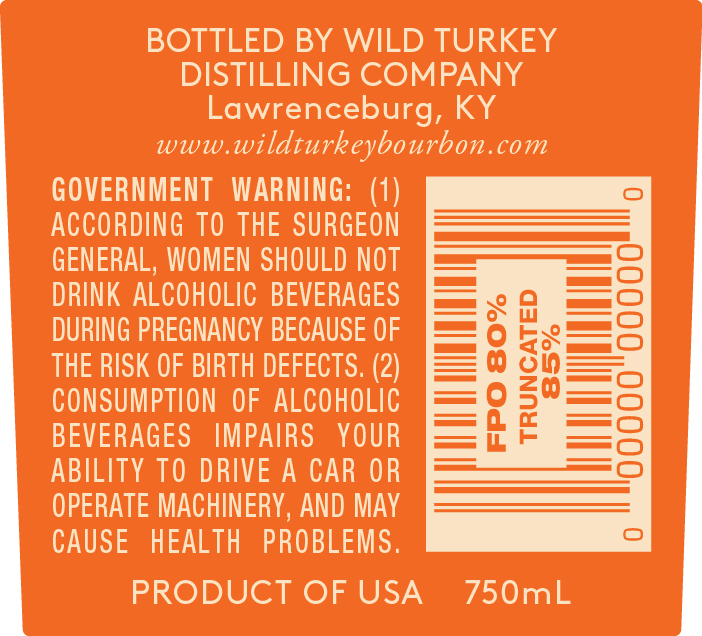
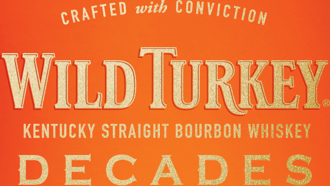
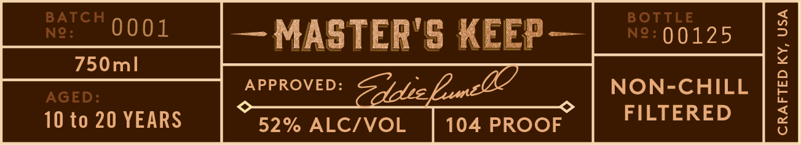
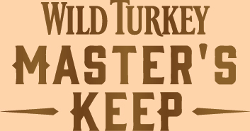

# TTB COLA Label Images - TTBID 15260001000475

**Brand Name:** WILD TURKEY

**Fanciful Name:** DECADES

**Issue Date:** 10/06/2015

**Origin Code:** 22

**Product Class/Type:** 101

**Source:** [TTB Public COLA Registry](https://ttbonline.gov/colasonline/viewColaDetails.do?action=publicFormDisplay&ttbid=15260001000475)

## Label Images

### Back Label

### Front Label

### Label 2

### Label 3

### Label 5

## Extracted Label Text

*Text extracted via OCR - may contain errors*

### Back Label

BOT

nia

WILD TURKEY

C

G COMPA

ANY

ep

Lowi

A

wu

Wis

y}

a

COM

pI

N

ap )VERNME

Ta

NT

n

DIN

io

SUI

EO

NE

Wl

MEI

LD

———$—{=)

LCOH

OLIC

=

CA

RY

j=)

GNA

cr

i=)

Th

CONSUN

ON

Of

7

BI

EV

El

IMI

AR

y

=O

|

ILITY T

qi

cI

HIN!

N

A

LM

Pp

fe}

- |

"7

DI

A

750ml

### Front Label

CRAFTED 126? FONVICTigy

WILD TURKEY

KENTUCKY STRAIGHT BOURBON WHISKEY

DECADES

### Label 2

— MASTER'S KEEP —

QA

104 PROOF

### Label 3

we

~ F

fe

an r

oS

aN

oe

nem

ae

—

Pes

5S

ae,

ae

omen

—

ad

x

a

“a

a

EE

ZA:

eo

oF

ee

(7) fg

Se

iS

y

ee

j.

£-£

—

Ce

AVE

~

### Label 5

WILD TURKEY

MASTER'S
