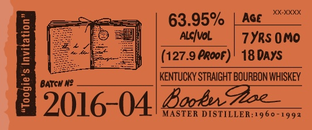
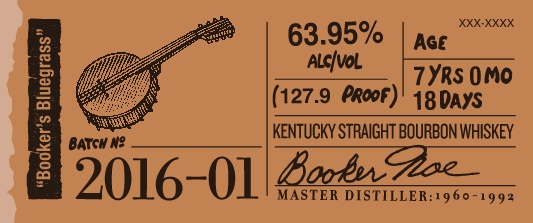
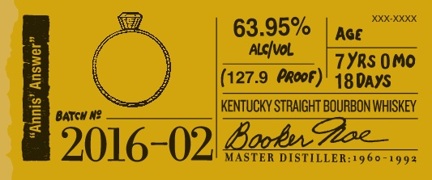
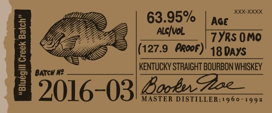
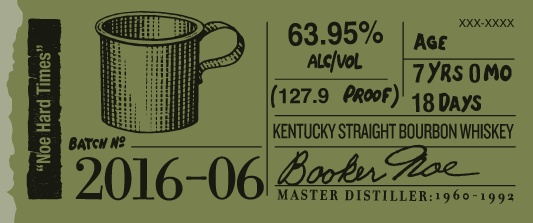
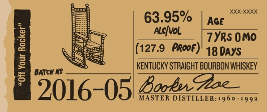

# TTB COLA Label Images - TTBID 15285001000120

**Brand Name:** BOOKER'S

**Fanciful Name:**  

**Issue Date:** 11/19/2015

**Origin Code:** 22

**Product Class/Type:** 101

**Source:** [TTB Public COLA Registry](https://ttbonline.gov/colasonline/viewColaDetails.do?action=publicFormDisplay&ttbid=15285001000120)

## Label Images

### Label 1

### Label 2

### Label 3

### Label 4

### Label 5

### Label 6

### Label 7

### Label 8

### Label 9

## Extracted Label Text

*Text extracted via OCR - may contain errors*

*1 image(s) excluded: text did not meet readability threshold*

**Detected Proof:** 127.9
**Detected Age:** 7 Years

### Label 1

63.95%
Age
[
AlsIval
7YRS 0Mo
(127.9 PRopf)
18 DAYS
KeNTUCKY STRAIGHT BOURBON WHISKEY
BATGH N?
[2o16 04222
MASTER DISTILLER:1960 -
992

### Label 2

XXXX
63.95%
Aqe
]
AlcIval
7YRs OMO
(127.9 Proof)
18DAYS
KeNTuCKY STRAIGHT BOURBON WHISKEY
1
BATGH N?
2016-01/8o52zz
MASTER DISTILLER:19 60 -
992

### Label 3

XXX-XXXX
63.95%
Aqe
AlcIval
1
7YRs 0MO
(127.9 PRoof)' 18DAYS
KeNTuCKY STRAIGHT BOURBON WHISKEY
9
BATGH N?
2016-02/ 8o5,2z
MASTER DISTILLER:-960 -
992

### Label 4

XXX-XXXX
63.95%
Aqe
3
AlcIval
7YRS OMO
((127.9
propf)
18 DAYS
]
BATGH N?
keNTuCKY STRAIGHT BOURBON WHISKEY
2016-03/8227222
MASTER DISTILLER:1960 -
992

### Label 5

XXX-XXXX
63.95%
Age
AlcIval
7YRS 0MO
I
((127.9
Proof)  18DaYS
KeNTuCKY STRAIGHT BOURBON WHISKEY
BaTGH N?
2016-061 8on4u22z;
MASTER DISTILLER:1960 -
992

### Label 6

BBooenh
@he
wn Ho packoae _
The
Mlght gpadebrunbon-chabz
1
"zaashon -andoenean |
1
my gndfath-fm Zoam Dstha
Whuksfron d Ro eigtt _
022,
ZS0ML
Erker? 3urbh4
"fazhftnlel
remobe mnly pieces _
banelband
124-/420-
9fisbt ~
~Ga (

### Label 7

XXX-XXXX
63.95%
Aqe
AlcIval
7Yrs 0MO
1
(127.9 eropf)
18DAYS
keNTuCKY STRAIGHT BOURBON WHISKEY
BATGH N?
2016-051 825,7222
MASTER DISTILLER:19 60 -
992

### Label 8

BOOKER'Se KENTUCKY STRAIGHT BOURBON WHISKEY
DISTILLED AND BOTTLED BY JAMES B. BEAM DISTILLING CO_
CLERMONT, KENTUCKY
GOVERNMENT WARNING: C
ACCORDIHG TO
THE   SURGEOH  GENERAL, WOMEN   ShOuLI
NOT DRNKALCOHOLIC BEVERAGES DUFIG
PREGHANCY
BECAUSE
OF
THE
RISK
OF BIRTH defects. (2| COMSUMPTLON OF
AlCOhOlC BEVERAGES   IMPAIRS  YOUR
abiLty TO DRIVE A CAR OR OPERATE MAChI:
ERK, AND  MAY  CAUSE  health  PROBLEMS ,
80686"01140'
ME VT REF [Sc + IA REF Sc
124-2455-A
