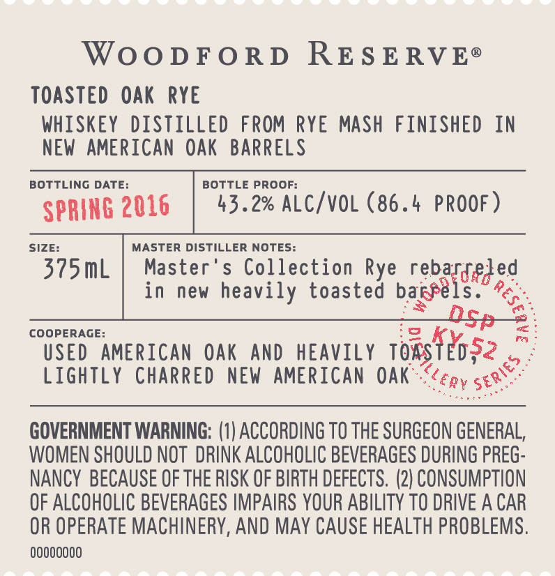

# TTB COLA Label Images - TTBID 16022001000457

**Brand Name:** WOODFORD RESERVE

**Fanciful Name:** DISTILLERY SERIES TOASTED OAK RYE

**Issue Date:** 02/14/2016

**Origin Code:** 22

**Product Class/Type:** 112

**Source:** [TTB Public COLA Registry](https://ttbonline.gov/colasonline/viewColaDetails.do?action=publicFormDisplay&ttbid=16022001000457)

## Label Images

### Back Label

### Front Label

### Label 3

### Label 4

