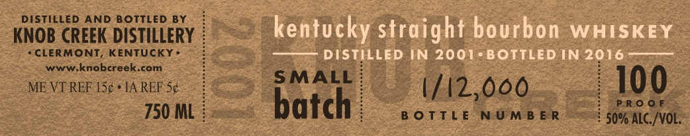
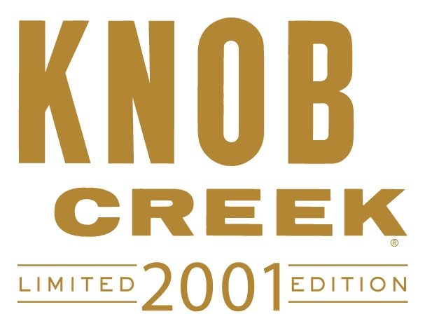
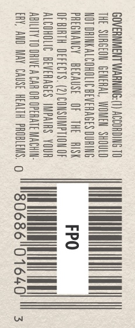
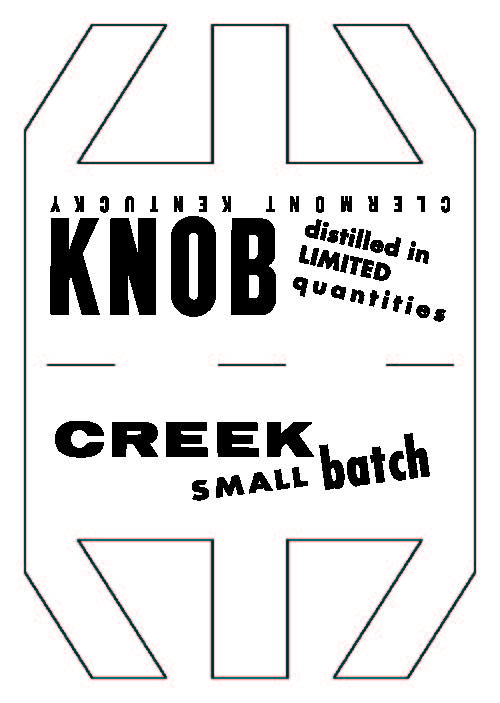

# TTB COLA Label Images - TTBID 16029001000425

**Brand Name:** KNOB CREEK

**Fanciful Name:**  

**Issue Date:** 02/19/2016

**Origin Code:** 22

**Product Class/Type:** 101

**Source:** [TTB Public COLA Registry](https://ttbonline.gov/colasonline/viewColaDetails.do?action=publicFormDisplay&ttbid=16029001000425)

## Label Images

### Label 1

### Label 2

### Label 3

### Label 4

## Extracted Label Text

*Text extracted via OCR - may contain errors*

*1 image(s) excluded: text did not meet readability threshold*

### Label 1

DISTiLed AND BOTTLED BY
KNOB CREEK DISTILLERY
kentucky straight bourbon
WHISKEY
CLERMONT_
KENTUCKY
DISTILLED IN 2001. BOTTLED IN 2016
WWW knobcreek com
ME VT REF [Sc . IA REF Sc
SMALL
1/12,060
100
750 ML
batch
B 0Tt L E
NU M B E R
5096A8 /VOL;

### Label 3

GOVERNMENT WARNING:(T) ACCORDING 10
THE SURGEON GENERAL, WOMEN SHOULD
NOT DRINKALCOHOLIC BEVERAGES DURING
PREGNANCY BECAUSE OF THE AISK
OFBIRTH DEFECTS. (2) CONSUMPTION OF
ALCOHOLIC BEVERAGES IMPAIRS YOUR
ABILITY TO DRIVEA CAR OR OPERATE MACHIN-
ERY, AND MAY CAUSE HEALTH PROBLEMS. o

### Label 4

Z| 1\

AWONINGY PNOWYa19

UMiten

‘Stilleg

in

K

TWantitie,

CREEK

sMALL

batch

\ |

L,
