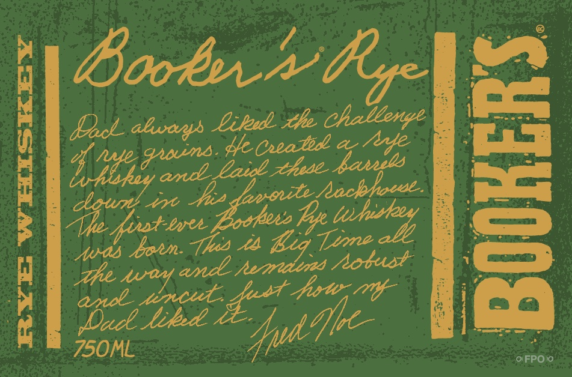
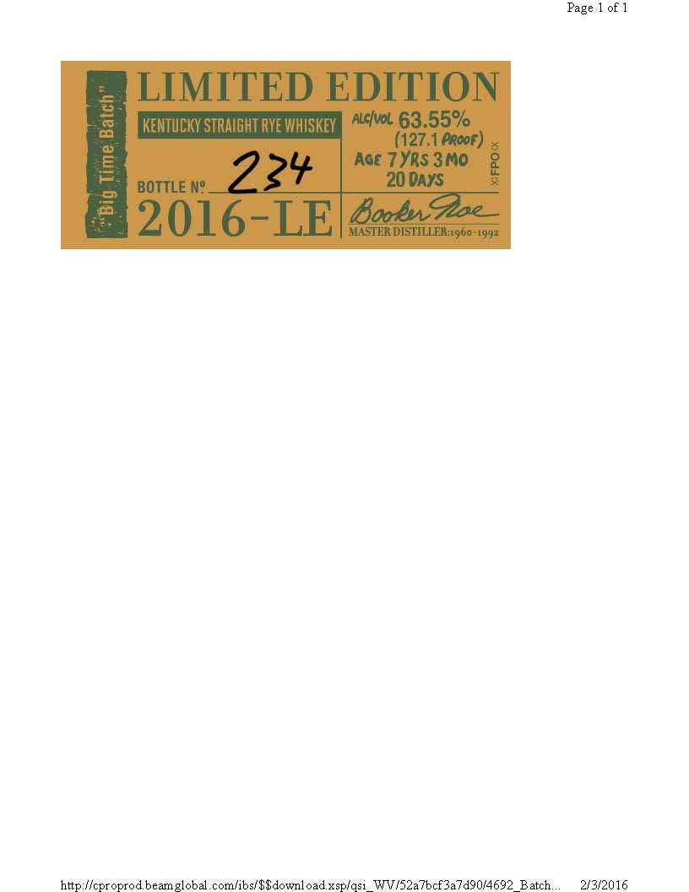
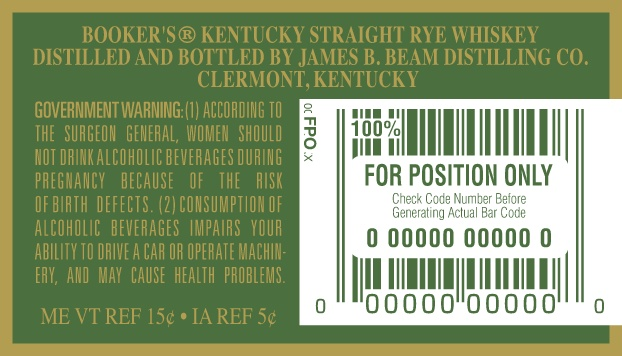
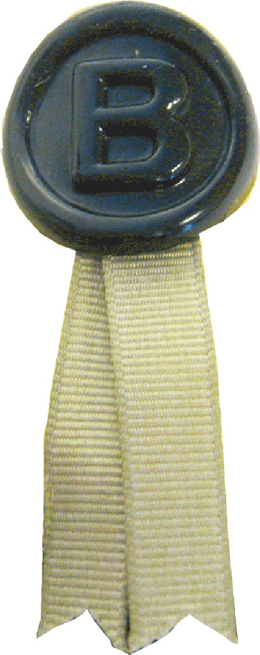

# TTB COLA Label Images - TTBID 16034001000224

**Brand Name:** BOOKER'S

**Fanciful Name:**  

**Issue Date:** 02/22/2016

**Origin Code:** 22

**Product Class/Type:** 142

**Source:** [TTB Public COLA Registry](https://ttbonline.gov/colasonline/viewColaDetails.do?action=publicFormDisplay&ttbid=16034001000224)

## Label Images

### Label 1

### Label 2

### Label 3

### Label 4

## Extracted Label Text

*Text extracted via OCR - may contain errors*

*1 image(s) excluded: text did not meet readability threshold*

**Detected Age:** 7 Years

### Label 1

Boobsh
Dac_ahanys Eileu he chaltenge
1
Asihq
ZacGaeate
Jallts
C
Meeu
Ib
"ehe Hpabley
Ine Baz
1
Auds Bohm- Thos
Ma
AA
Unoeaee
wuar
E
Mincul:
hot  mtt
DDac tiked
ZS0ML
0 FPOiO
Re
Msins:
a
anoite
fust-eec,
and
Ie
4=
aq00
Idh

### Label 2

of 1
LIMITED EDITION
0
KentucKy StRaIGHT RvE WhISKeY
AlcivoL 63.55%
(127.1 Peoof)
3
AGe 7 YRS 3M0
BOTTLE N? _
22y
20 DAYS
22016-LE 8anz
MASTER DISTILLER:.960-1994
http } {cproprod beamglobal comlibsl$Sdownloadxsplqsi
WV/52aZbcf3a7490/4692 Batch ..
2/3/2016
Page

### Label 3

BOOKER'S@ KENTUCKY STRAIGHT RYE WHISKEY
DISTILLED AND BOTTLED BY JAMES B. BEAM DISTILLING CO:
CLERMONT, KENTUCKY
GOVERNMENT WARNING; (
ACCORDING TO
THE   SURGEOH   GEMERAL, WOMEN   shOULD
3
Td0%
HOT DRIHK ALCOHOLIC beveRaGeS OURIG
PREGHANCY   BECAUSE
THE
RISK
FOR POSITION ONLY
OF BIRTH DEFECTS. (2| CONSUMPTLOH OF
Check Cade Number Before
Gererating Aclual
Bar Code
alCOhOLc   BEVERAGES   IMPAIRS   YOUR
0000O 00000 0
AbILITY TO DRIVE a CAR OR OPERATE MAChI:
ERY, ALD   MaY  CauSe  HEALTh  PROBLEMS.
000
0000
ME VT REF 15c
IA REF Sc
