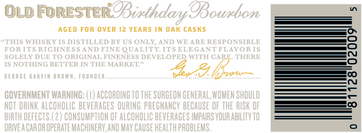
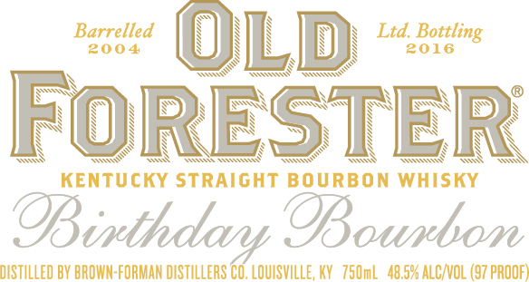
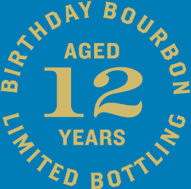

# TTB COLA Label Images - TTBID 16061001000300

**Brand Name:** OLD FORESTER

**Fanciful Name:** BIRTHDAY BOURBON 2016

**Issue Date:** 03/15/2016

**Origin Code:** 22

**Product Class/Type:** 101

**Source:** [TTB Public COLA Registry](https://ttbonline.gov/colasonline/viewColaDetails.do?action=publicFormDisplay&ttbid=16061001000300)

## Label Images

### Back Label

### Label 1

### Label 3

### Label 4

### Label 5

## Extracted Label Text

*Text extracted via OCR - may contain errors*

*1 image(s) excluded: text did not meet readability threshold*

**Detected Proof:** 97
**Detected Age:** 12 Years

### Back Label

OLd
FORESTEROBinthdar 9Bounbon
AGED For OVER 12 YEARS IN OAK cASKS
"THIS WHISKY IS DISTILLED BY US ONLY
AND WE ARE RESPONSIBLE
RORTTS RTCHMES 5 AMD FTNTE
QUALITY ITS ELEGANT FLAVOR IS
SOLELY DUE TO ORIGINAL FINENESS DEVELOPED WITH CARF THERE
1S NOTHING BETTER IN THE MARKET"
GEORGE GARVAM BROWUM
FO UMDER
bz=
GOVERNMENT WARNING: (4) ACCORDING TO THE SURGEON GENERAL, WOMEN shOuLD
NOT DRINK ALCOHOLIC BEVERAGES DURING PREGNANCY BECAUSE OF THE RISK OF
BIRTH DEFECTS (2 ) CONSUMPTLON OF ALCOHOLIC BEVERAGES IMPAIRS VOUR ABILITV TO
DRIVEA CAR OR OPERATE MACHINERV; AND Mav CAUSE HEALTH PROBLEMS ,

### Label 1

Barrelled
Ltd:
200 4
@OLD
2016
FORESTER
KenTUCKY StRaIGHT BOURBON
WHISKY
@Binthdary OBourbon
DISTILLED BY BROWN-FORMAN DISTILLERS CO, LOUISVILLE, KY   75OmL  48,594 ALC/VOL (97 pROOF)
Bottling

### Label 3

FIRST BOTTLED BOURBON

Nogdunod daillog 1suld

### Label 4

AGED
12
r
YEARS
DAY
)
{
ROTTLING
IMITED
