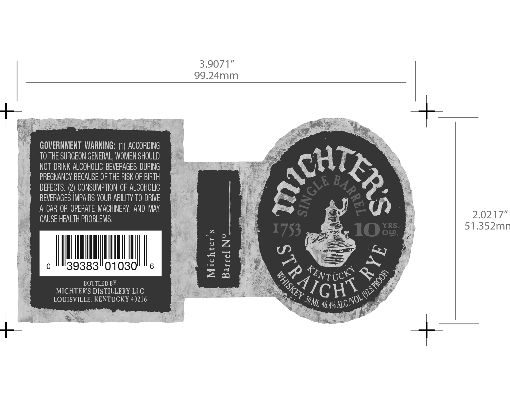

# TTB COLA Label Images - TTBID 16085001000483

**Brand Name:** MICHTER'S

**Fanciful Name:** 10 YRS OLD

**Issue Date:** 04/12/2016

**Origin Code:** 22

**Product Class/Type:** 102

**Source:** [TTB Public COLA Registry](https://ttbonline.gov/colasonline/viewColaDetails.do?action=publicFormDisplay&ttbid=16085001000483)

## Label Images

### Label 1

## Extracted Label Text

*Text extracted via OCR - may contain errors*

### Label 1

3.9071”

99.24mm

GOVERNMENT WARNING: (1) ACCORDING

TO THE SURGEON GENERAL, WOMEN SHOULD

NOT DRINK ALCOHOLIC BEVERAGES DURING

oa

PREGNANCY BECAUSE OF THE RISK OF BIRTH

DEFECTS. (2) CONSUMPTION OF ALCOHOLIC

BEVERAGES IMPAIRS YOUR ABILITY TO DRIVE

A CAR OR OPERATE MACHINERY, AND MAY

CAUSE HEALTH PROBLEMS.

2.0217"

51.352mn

UL

it

0

39383

|

01030)

|

6

a

Ss)

BOTTLED BY

EV TIC

MICHTER’S DISTILLERY LLC

Se

we

Ve

LOUISVILLE, KENTUCKY 40216

sor

i

4 ALC,

we

Ne
