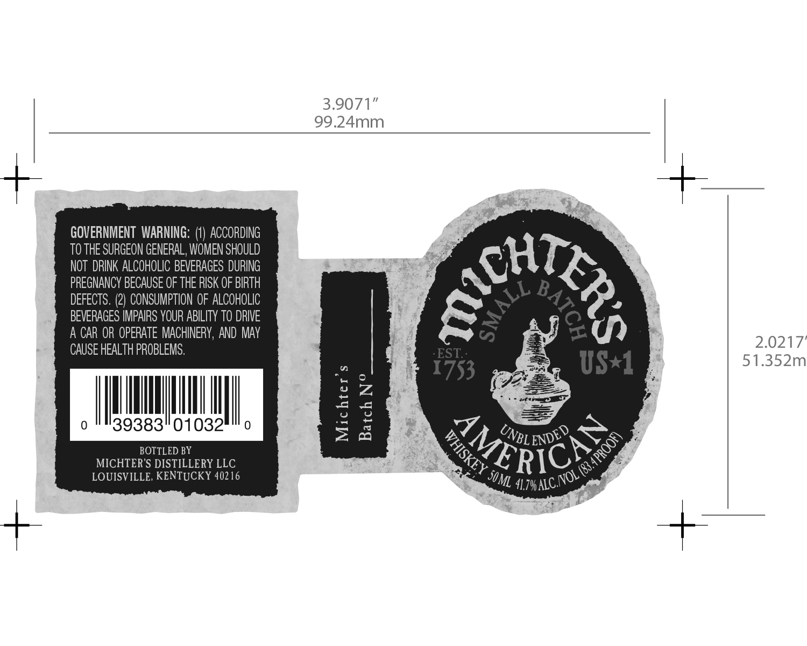

# TTB COLA Label Images - TTBID 16085001000490

**Brand Name:** MICHTER'S

**Fanciful Name:** UNBLENDED

**Issue Date:** 04/12/2016

**Origin Code:** 22

**Product Class/Type:** 140

**Source:** [TTB Public COLA Registry](https://ttbonline.gov/colasonline/viewColaDetails.do?action=publicFormDisplay&ttbid=16085001000490)

## Label Images

### Label 1

## Extracted Label Text

*Text extracted via OCR - may contain errors*

### Label 1

3.9071”
99.24mm

GOVERNMENT WARNING: (1) ACCORDING
TO THE SURGEON GENERAL, WOMEN SHOULD
NOT DRINK ALCOHOLIC BEVERAGES DURING
PREGNANCY BECAUSE OF THE RISK OF BIRTH
DEFECTS. (2) CONSUMPTION OF ALCOHOLIC
BEVERAGES IMPAIRS YOUR ABILITY T0 DRIVE .
A CAR OR OPERATE MACHINERY, AND MAY i ay 2.0217’
CAUSE HEALTH PROBLEMS. ' poe { :

51.352m

MMM

39383"01032"" 0

BOTTLED BY
MICHTER’S DISTILLERY LLC
LOUISVILLE, KENTUCKY 40216

a
Ps
2 Zz
a wa
oO
& Se
—_—
P=)

0
