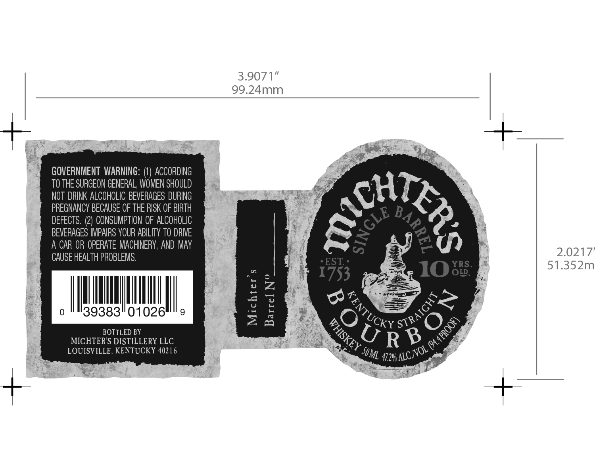

# TTB COLA Label Images - TTBID 16085001000498

**Brand Name:** MICHTER'S

**Fanciful Name:** 10 YRS OLD

**Issue Date:** 04/12/2016

**Origin Code:** 22

**Product Class/Type:** 101

**Source:** [TTB Public COLA Registry](https://ttbonline.gov/colasonline/viewColaDetails.do?action=publicFormDisplay&ttbid=16085001000498)

## Label Images

### Label 1

## Extracted Label Text

*Text extracted via OCR - may contain errors*

### Label 1

3.9071"
99.24mm
GOVERNMENT WARNING:
ACCORDING
TO THE SURGEON GENERAL, WOMEN SHOULD
NOT  DRINK ALCOHOLIC BEVERAGES DURING
PREGNANCY BECAUSE OF THE RISK OF BIRTH
Ehta
DEFECTS. (2) CONSUMPTION OF ALCOHOLIC
BEVERAGES IMPAIRS YOUR ABILITY TO DRIVE
A CAR OR OPERATE MACHINERY, AND MAY
CAUSE HEALTH PROBLEMS.
2.0217
EST
YRS
51.352m
1753
IOo8
39383"01026
J1
DJ
BOTTLED BY
MICHTER'S DISTILLERY LLC
LOUISVILLE, KENTUCKY 40216
47206 _
1
0
88k6o
KENTUCK €
STRAIGHT
1
WHISKEY =
'ALCNOL €
SOML
