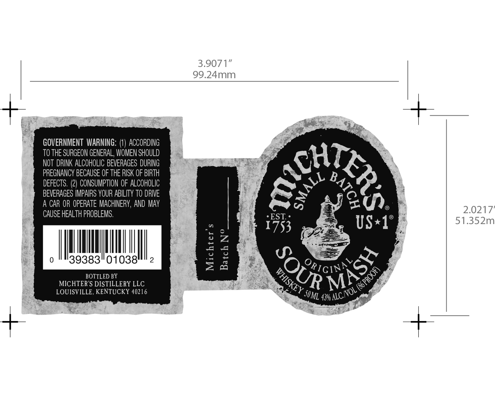

# TTB COLA Label Images - TTBID 16085001000509

**Brand Name:** MICHTER'S

**Fanciful Name:** ORIGINAL SOUR MASH

**Issue Date:** 04/12/2016

**Origin Code:** 22

**Product Class/Type:** 140

**Source:** [TTB Public COLA Registry](https://ttbonline.gov/colasonline/viewColaDetails.do?action=publicFormDisplay&ttbid=16085001000509)

## Label Images

### Label 1

## Extracted Label Text

*Text extracted via OCR - may contain errors*

### Label 1

3.9071"

99.24mm

GOVERNMENT WARNING: (1) ACCORDING

TO THE SURGEON GENERAL, WOMEN SHOULD

NOT DRINK ALCOHOLIC BEVERAGES DURING

MT,

PREGNANCY BECAUSE OF THE RISK OF BIRTH

DEFECTS. (2) CONSUMPTION OF ALCOHOLIC

BEVERAGES IMPAIRS YOUR ABILITY TO DRIVE

\ By

A CAR OR OPERATE MACHINERY, AND MAY

CAUSE HEALTH PROBLEMS.

=(),

2.0217

EST.

®

51.352m

i

1753

US*1

(2

: >

MU

NU

ete el”

|

|

|

2

=

0

39383

01038

BOTTLED BY

K@) Fic

SS

MICHTER’S DISTILLERY LLC

Si

SZ

LOUISVILLE, KENTUCKY 40216

ay)

os

ML 43% ALC:

33)
