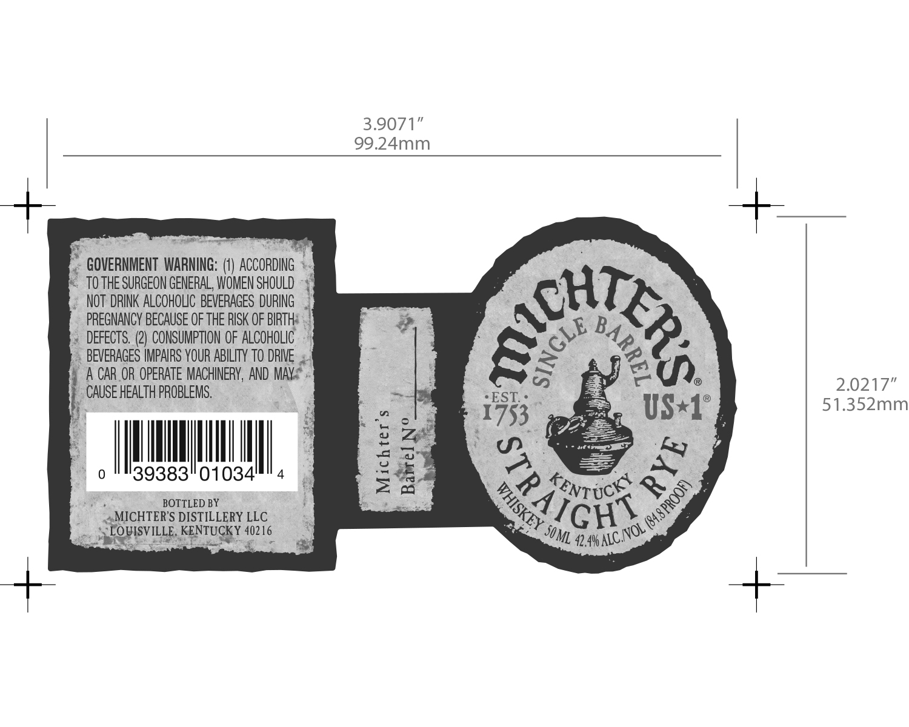

# TTB COLA Label Images - TTBID 16085001000514

**Brand Name:** MICHTER'S

**Fanciful Name:** SINGLE BARREL

**Issue Date:** 04/12/2016

**Origin Code:** 22

**Product Class/Type:** 102

**Source:** [TTB Public COLA Registry](https://ttbonline.gov/colasonline/viewColaDetails.do?action=publicFormDisplay&ttbid=16085001000514)

## Label Images

### Label 1

## Extracted Label Text

*Text extracted via OCR - may contain errors*

### Label 1

3.9071”
99.24mm

~ GOVERNMENT WARNING: (1) ACCORDING =.
F TOTHE SURGEON GENERAL, WOMEN SHOULD 4
«NOT DRINK ALCOHOUC BEVERAGES DURING
PREGNANCY BECAUSE OF THE AISK OF BIRTH
« DEFECTS. (2) CONSUMPTION OF ALCOHOLIC.
|. BEVERAGES IMPAIRS YOUR ABILITY TO DRIVE
ALCAR OR OPERATE MACHINERY, AND MAY-*.
_ CAUSE HEALTH PROBLEMS,

IEAM

39383"01034

2.0217”
51.352mm

_

10

RO BOTTLED BY
_ @MICHTER'S DISTILLERY LLC

__S FQVISVILLE KENTUGRY 4216

"e
oO
4
a
oe
Le
