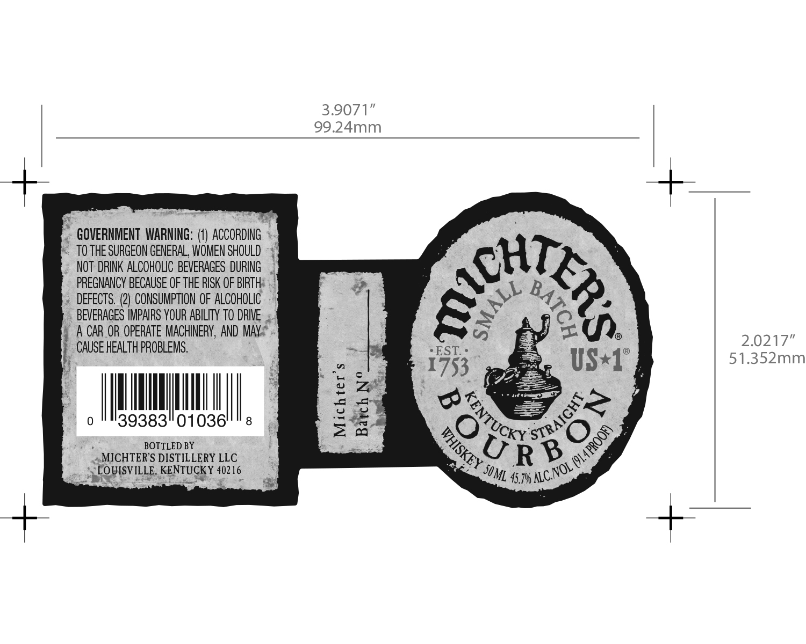

# TTB COLA Label Images - TTBID 16085001000517

**Brand Name:** MICHTER'S

**Fanciful Name:** SMALL BATCH

**Issue Date:** 04/12/2016

**Origin Code:** 22

**Product Class/Type:** 101

**Source:** [TTB Public COLA Registry](https://ttbonline.gov/colasonline/viewColaDetails.do?action=publicFormDisplay&ttbid=16085001000517)

## Label Images

### Label 1

## Extracted Label Text

*Text extracted via OCR - may contain errors*

### Label 1

3.9071”

99.24mm

_

e GOVERNMENT WARNING: ACC a

TOTHE SURGEON GENERAL, WOMEN SHOULD ~ 4

NOT DRINK ALCOHOLIC BEVERAGES DURING

MT,

PREGNANCY BECAUSE OF THE RISK OF BIRTH |

DEFECTS. (2) CONSUMPTION OF ALCOHOLIC

4b

BEVERAGES IMPAIRS YOUR ABILITY TO DRIVE ..

t.

?.

§ A CAR.OR OPERATE MACHINERY, AND MAYA"

Ey

2.0217”

_ CAUSE HEALTH PROBLEMS.

EST.

51.352mm

1753

US«1

PMN

(e)

|

39383"01036

2a

CR ss”

BOTTLED BY

A

20

Os

“MICHTER'S DISTILLERY LLC

‘>

JOM, 4574 CNS

ARIELLE RENTS 26
