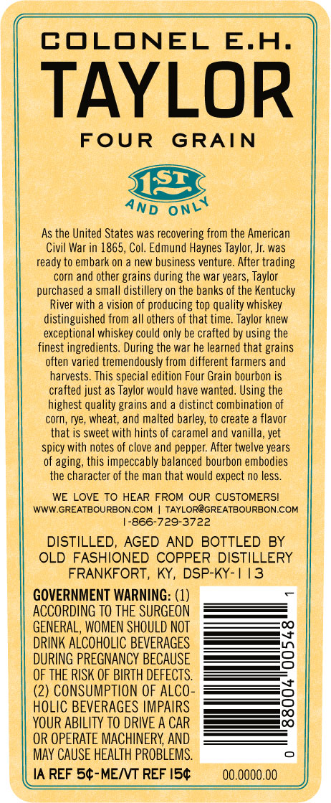

# TTB COLA Label Images - TTBID 16117001000016

**Brand Name:** E. H. TAYLOR

**Fanciful Name:**  

**Issue Date:** 05/19/2016

**Origin Code:** 22

**Product Class/Type:** 101

**Source:** [TTB Public COLA Registry](https://ttbonline.gov/colasonline/viewColaDetails.do?action=publicFormDisplay&ttbid=16117001000016)

## Label Images

### Back Label

### Label 1

### Label 3

## Extracted Label Text

*Text extracted via OCR - may contain errors*

**Detected Proof:** 100

### Back Label

COLONEL
E.H.
TAYLOR
FOUR
GRAIN
As the United States was recovering from the American
Civil War in 1865, Col. Edmund Haynes Taylor; Jr was
ready to embark 0n
new business venture. After trading
corn and other grains during the war years, Taylor
purchased
small distillery on the banks of the Kentucky
River with
vision of producing top quality whiskey
distinguished from all others of that time. Taylor knew
exceptional whiskey could only be crafted by using the
finest ingredients. During the war he learned that grains
often varied tremendously from different farmers and
harvests. This special edition Four Grain bourbon is
crafted just as Taylor would have wanted. Using the
highest quality grains and
distinct combination of
corn, rye, wheat; and malted barley; to create
flavor
that is sweet with hints of caramel and vanilla, yet
spicy
notes of clove and pepper: After twelve years
of aging; this impeccably balanced bourbon embodies
the character of the man that would expect no less.
WE LOVE TO HEAR FROM OUR CUSTOMERSI
WWW GREATBOURBON.COM
TAYLOR@GREATBOURBON.COM
866-729-3722
DISTILLED;
AGED AND BOTTLED BY
OLD FASHIONED COPPER DISTILLERY
FRANKFORT,
KY, DSP-KY- | 13
GOVERNMENT WARNING: (1)
ACCORDING TO
SURGEON
GENERAL, WOMEN SHOULD NOT
DRINK ALCOHOLIC BEVERAGES
DURING PREGNANCY BECAUSE
OF THE RISK OF BIRTH DEFECTS.
(2) CONSUMPTION OF AlCO-
HOLIC BEVERAGES IMPAIRS
YOUR ABILITY TO DRIVE A CAR
OR OPERATE MACHINERY AND
May CAUSE HEALTH PROBLEMS.
IA REF 54-MENT REF I54
00.0000.0O
5132
ONLY
AND
with
THE

### Label 1

COLONEL
E.A.
TAYLOR
FOUR
GRAIN
1
5
L
%
1
0
m?
8
1
9
1
6
I
F
8
9
L
1
2
BOTTLED IN BOND
50%
ALCIVOL [I00
PROOF ]
750ML
ISr
ONLY
AND

### Label 3

JgocigogigogocogocagocigocicocicigocagocigocigogicG
Jcagocidocigocicigocigocigocigocicogocigocagocigocigocicigocagocau
COC DCJCocgGoccocoooC-CJGoojGocjd_
06d06ocodocodjdoco
ocodocococococococodo
00006jd6cjd6c0oodod
07moga
2
0c0c
Jococigo
